# AgroSense Project Report

Generated on: 2026-08-08  
Project root: `/Volumes/dishan project/frontend agrosense`  
Primary stack: Next.js 16, React 19, FastAPI, PyTorch, scikit-learn, LightGBM/XGBoost style tabular models, Tesseract OCR

## 1. Executive Summary

AgroSense is a farmer-facing decision support application. It reads a Soil Health Card, extracts the nutrient readings, optionally classifies a soil photograph, and returns crop and fertilizer recommendations. The product is designed around a practical rule: measured soil-card readings should lead the advice, and model predictions should support that advice only where they are trustworthy.

The current project has four major parts:

| Area | What it does | Current status |
| --- | --- | --- |
| Frontend | Next.js site, Marathi/English UI, card upload, result displays, prediction panels | Present and wired to local API routes |
| Next API routes | Server-side proxy from browser to Python service | Present in `src/app/api/card` and `src/app/api/predict` |
| Backend | FastAPI service for ingestion, OCR, document storage, RAG, and model serving | Present in `backend/` |
| ML | Soil image classifier, crop recommender, fertilizer recommender, training scripts, metadata | Trained artifacts present in `ML/models/` |

Important current ML status:

| Model | Shipped artifact | Model type | Current score |
| --- | --- | --- | --- |
| Soil classifier | `ML/models/soil_model.pth` | EfficientNet-B0 | CV macro-F1 0.906, accuracy 0.912 |
| Crop recommender | `ML/models/crop_model.pkl` | LightGBM | CV macro-F1 0.994, accuracy 0.994 |
| Fertilizer recommender | `ML/models/fertilizer_model.pkl` | LightGBM | Hold-out macro-F1 0.190, accuracy 0.195, top-3 accuracy 0.519 |

The fertilizer model is intentionally not allowed to make the final buying decision alone. The served path ranks fertilizer bags by the card's N-P-K deficits and uses the model mostly as a tie-breaker.

## 2. Product Goal

The project answers this farmer workflow:

1. Upload a Soil Health Card as PDF or image.
2. Optionally upload a soil photograph.
3. Extract the card's twelve soil readings.
4. Mark readings as low, normal, or high using the ranges printed on the card.
5. Classify the soil image into one of eight trained soil classes.
6. Recommend crops from N, P, K, pH, temperature, humidity, and rainfall.
7. Re-rank crop recommendations using the identified soil type.
8. Recommend fertilizers only when they match measured nutrient needs.
9. Warn the user when readings came from OCR and need manual review.

## 3. High-Level Architecture

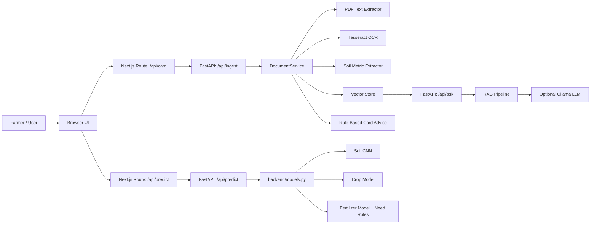

## 4. Repository Map

| Path | Purpose |
| --- | --- |
| `src/app/` | Next.js app router pages, layouts, API routes |
| `src/app/api/card/route.ts` | Browser-to-FastAPI proxy for Soil Health Card ingestion |
| `src/app/api/predict/route.ts` | Browser-to-FastAPI proxy for soil/crop/fertilizer prediction |
| `src/components/site/` | Main UI sections: upload, reading, prediction, weather, details |
| `src/data/` | Static domain data for crops, soils, fertilizers, sample predictions, weather |
| `src/lib/` | Shared frontend state, API helpers, formatting, types, i18n |
| `backend/app.py` | FastAPI application and endpoint definitions |
| `backend/document_service.py` | Upload storage, extraction, indexing, re-read logic |
| `backend/soil_report.py` | Soil Health Card metric extraction and merge logic |
| `backend/ocr.py` | Multi-pass Tesseract OCR strategy |
| `backend/models.py` | Lazy loading and serving for soil, crop, fertilizer models |
| `backend/vector_store.py` | Local pickle-backed retrieval store |
| `backend/rag_pipeline.py` | Retrieval-augmented answer generation |
| `ML/prepare_soil_dataset.py` | Soil image de-duplication, fold creation, augmentation |
| `ML/train_soil.py` | Soil classifier training and architecture bake-off |
| `ML/train_crop.py` | Crop recommender retraining |
| `ML/train_fertilizer.py` | Fertilizer recommender retraining |
| `ML/tabular.py` | Shared tabular model bake-off helpers |
| `ML/models/` | Generated model artifacts and metadata |

## 5. Runtime Flow

### 5.1 Card Upload Flow

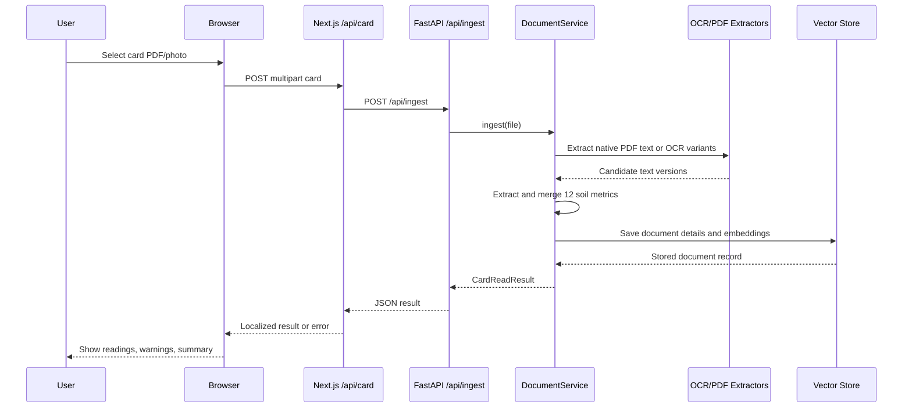

### 5.2 Prediction Flow

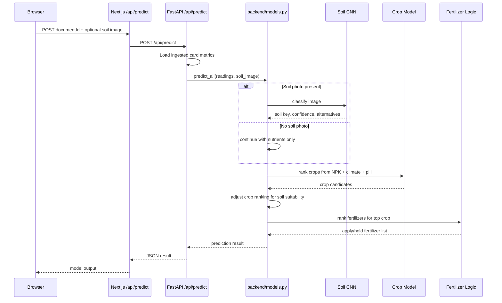

## 6. Backend API

| Route | Method | Purpose |
| --- | --- | --- |
| `/api/health` | GET | Service health, OCR availability, accepted suffixes, model availability |
| `/api/ingest` | POST | Upload card, extract readings, index document |
| `/api/documents` | GET | List ingested documents |
| `/api/documents/{id}` | GET | Return one stored document, re-reading if extractor version changed |
| `/api/ask` | POST | Ask a question over indexed card context |
| `/api/predict` | POST | Run soil, crop, fertilizer prediction for an already-ingested card |

The backend intentionally has no browser-facing CORS layer. The browser talks to Next.js, and Next.js talks to FastAPI server-to-server. This keeps the reading service private.

## 7. Soil Health Card Extraction

The card extraction pipeline is one of the most important parts of the project. It is built to avoid confidently wrong readings.

### 7.1 Extracted Metrics

The extractor targets twelve readings:

| Key | Label |
| --- | --- |
| `available_boron` | Available Boron (B) |
| `available_nitrogen` | Available Nitrogen (N) |
| `available_phosphorus` | Available Phosphorus (P) |
| `available_potassium` | Available Potassium (K) |
| `ph` | pH |
| `ec` | EC |
| `organic_carbon` | Organic Carbon (OC) |
| `available_sulphur` | Available Sulphur (S) |
| `available_zinc` | Available Zinc (Zn) |
| `available_iron` | Available Iron (Fe) |
| `available_manganese` | Available Manganese (Mn) |
| `available_copper` | Available Copper (Cu) |

### 7.2 Extraction Pipeline Diagram

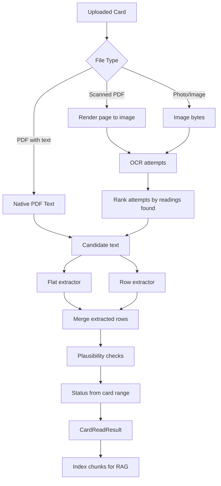

### 7.3 Why Multiple OCR Attempts Exist

Photographed cards are difficult because the document is bilingual, dense, and tabular. One OCR pass can miss rows or lose decimals. The project tries multiple OCR configurations:

| Attempt style | Why it exists |
| --- | --- |
| Scaled image + PSM 6 | Strong default for dense table-like cards |
| Plain image + PSM 6 | Avoids damage from unnecessary scaling |
| Boosted image + PSM 6 | Helps middle-resolution images |
| PSM 4 variants | Alternative page segmentation for different layouts |
| English-only fallback | Helps when multilingual OCR damages Latin labels |
| Binary threshold | Helps some low-contrast scans |
| Plain PSM 3 | Last-resort default behavior |

The service scores each attempt by how many of the twelve metrics it extracts. It can merge rows across attempts because different attempts miss different rows.

### 7.4 Safety Rules

| Rule | Why it matters |
| --- | --- |
| Use card-printed ranges | The farmer's own report is the source of truth |
| Reject physically implausible readings | Prevents lost decimal points from becoming advice |
| Vote on ranges before readings | Catches cases where OCR agrees on the wrong value but the range exposes it |
| Mark OCR readings as `unconfirmed` | The UI asks the user to manually verify photo-derived values |
| Delete unreadable uploads | Bad files are not retained as valid documents |

## 8. ML Pipeline Overview

```mermaid
flowchart LR
    RAW[Raw datasets] --> CLEAN[Clean / validate]
    CLEAN --> SPLIT[Train-validation split or CV folds]
    SPLIT --> TRAIN[Train candidate models]
    TRAIN --> SCORE[Score with macro-F1 and accuracy]
    SCORE --> SELECT[Select winner]
    SELECT --> SAVE[Write artifact + metadata]
    SAVE --> SERVE[FastAPI lazy-loads artifacts]
    SERVE --> UI[Next.js UI displays result]
```

## 9. Soil Classifier

### 9.1 Purpose

The soil classifier reads an uploaded soil photograph and predicts the soil class. It currently supports eight classes:

`alluvial`, `black`, `cinder`, `clay`, `laterite`, `peat`, `red`, `yellow`

The UI has a `sandy` static soil card, but the classifier cannot return `sandy` unless sandy images are added to the training dataset.

### 9.2 Training Pipeline

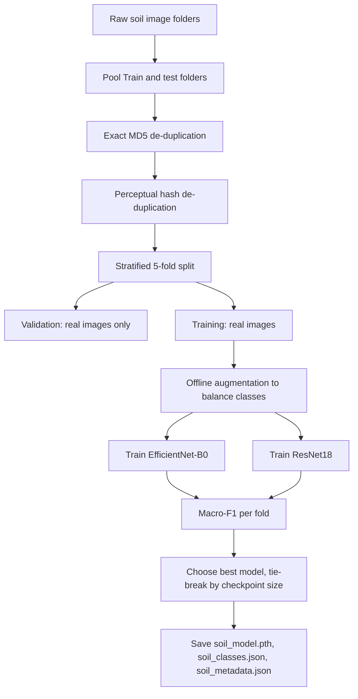

### 9.3 Current Soil Model Metadata

| Field | Value |
| --- | --- |
| Architecture | EfficientNet-B0 |
| Classes | 8 |
| Image size | 224 |
| Folds | 5 |
| Epochs | 12 |
| Warmup epochs | 2 |
| Batch size | 32 |
| Temperature | 0.4695 |
| Shipped fold | 2 |
| Checkpoint size | 16 MB |
| Trained at | 2026-08-08 20:02:42 |

### 9.4 Soil Model Scores

| Candidate | Macro-F1 mean | Macro-F1 std | Accuracy mean | Accuracy std | Size |
| --- | ---: | ---: | ---: | ---: | ---: |
| EfficientNet-B0 | 0.9058 | 0.0132 | 0.9116 | 0.0150 | 16 MB |
| ResNet18 | 0.9051 | 0.0118 | 0.9104 | 0.0135 | 44 MB |

EfficientNet-B0 shipped because it slightly led macro-F1 and was much smaller.

### 9.5 Soil Per-Class Recall

| Soil | Recall |
| --- | ---: |
| alluvial | 0.858 |
| black | 0.885 |
| cinder | 0.945 |
| clay | 0.905 |
| laterite | 0.873 |
| peat | 0.921 |
| red | 0.939 |
| yellow | 0.968 |

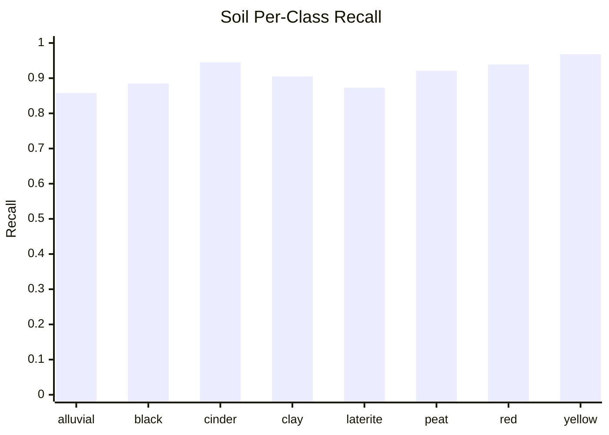

### 9.6 Best-Fold Confusion Matrix

Rows are truth and columns are predictions in this order:

`alluvial`, `black`, `cinder`, `clay`, `laterite`, `peat`, `red`, `yellow`

| Truth \ Pred | alluvial | black | cinder | clay | laterite | peat | red | yellow |
| --- | ---: | ---: | ---: | ---: | ---: | ---: | ---: | ---: |
| alluvial | 48 | 0 | 1 | 2 | 0 | 0 | 0 | 0 |
| black | 2 | 19 | 2 | 0 | 0 | 0 | 0 | 1 |
| cinder | 0 | 0 | 41 | 0 | 0 | 2 | 0 | 0 |
| clay | 0 | 0 | 0 | 21 | 0 | 1 | 0 | 1 |
| laterite | 0 | 0 | 0 | 0 | 50 | 1 | 1 | 0 |
| peat | 0 | 2 | 0 | 0 | 0 | 40 | 1 | 0 |
| red | 0 | 0 | 0 | 0 | 1 | 0 | 31 | 0 |
| yellow | 0 | 0 | 0 | 1 | 0 | 0 | 1 | 48 |

## 10. Crop Recommender

### 10.1 Purpose

The crop model recommends crops from the card and weather readings:

`N`, `P`, `K`, `temperature`, `humidity`, `ph`, `rainfall`

Earlier versions carried random soil one-hot columns. Those were removed because random columns do not encode soil knowledge. Soil now affects crop ranking through `backend/soil_crop_suitability.py`, which is explicit and reviewable.

### 10.2 Current Crop Model Metadata

| Field | Value |
| --- | --- |
| Model | LightGBM |
| Rows | 2,200 |
| Classes | 22 crops |
| CV accuracy | 0.9941 +/- 0.0023 |
| CV macro-F1 | 0.9941 |
| Trained at | 2026-08-08 19:03:29 |

### 10.3 Crop Classes

`apple`, `banana`, `blackgram`, `chickpea`, `coconut`, `coffee`, `cotton`, `grapes`, `jute`, `kidneybeans`, `lentil`, `maize`, `mango`, `mothbeans`, `mungbean`, `muskmelon`, `orange`, `papaya`, `pigeonpeas`, `pomegranate`, `rice`, `watermelon`

## 11. Fertilizer Recommender

### 11.1 Purpose

The fertilizer model predicts one of seven fertilizer products, but the production ranking is controlled by measured nutrient need. This is important because the hold-out model score is weak.

### 11.2 Current Fertilizer Model Metadata

| Field | Value |
| --- | --- |
| Model | LightGBM |
| Rows | 750,000 |
| Classes | 7 fertilizers |
| Hold-out accuracy | 0.1952 |
| Hold-out macro-F1 | 0.1896 |
| Hold-out top-3 accuracy | 0.5194 |
| Trained at | 2026-08-08 19:11:10 |

### 11.3 Fertilizer Classes

`10-26-26`, `14-35-14`, `17-17-17`, `20-20`, `28-28`, `DAP`, `Urea`

### 11.4 Fertilizer Decision Logic

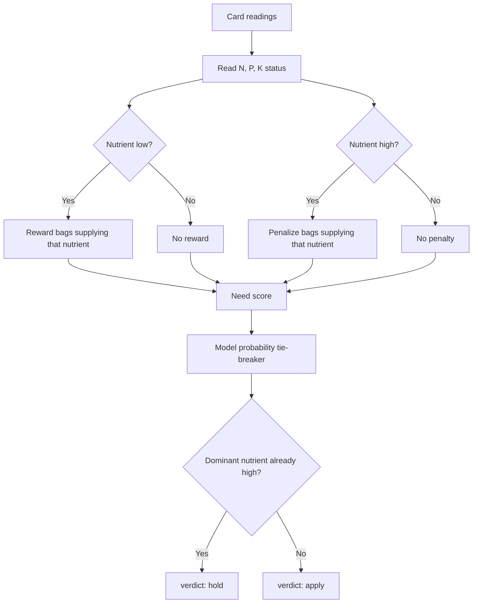

The `confidence` shown to the UI for fertilizer is the nutrient match, not raw model probability.

## 12. Model Quality Chart

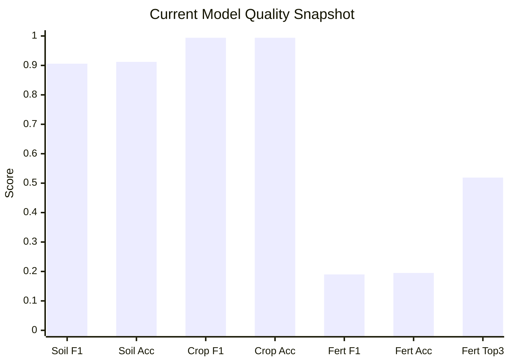

## 13. Model Artifact Size Chart

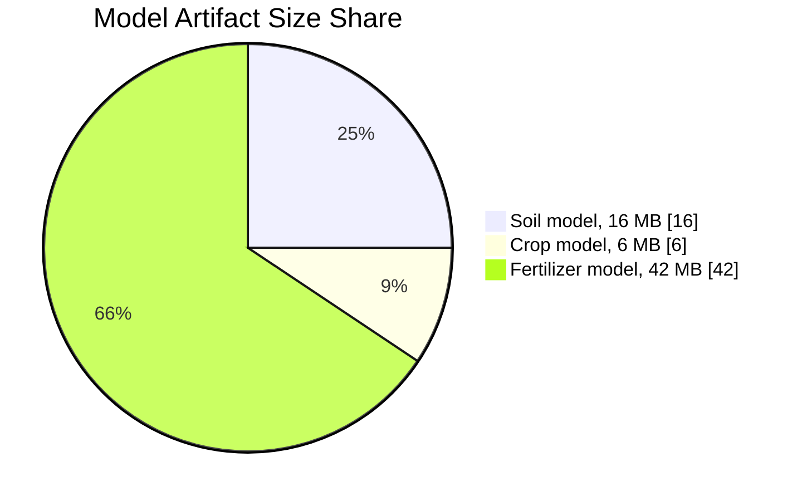

## 14. Current Model Artifacts

| Artifact | Size | Purpose |
| --- | ---: | --- |
| `ML/models/soil_model.pth` | 16 MB | Soil CNN checkpoint |
| `ML/models/soil_classes.json` | 94 B | Soil class labels |
| `ML/models/soil_metadata.json` | 4.3 KB | Soil architecture, scores, calibration |
| `ML/models/crop_model.pkl` | 6.1 MB | Crop recommender |
| `ML/models/crop_label_encoder.pkl` | 466 B | Crop label encoder |
| `ML/models/crop_scaler.pkl` | 576 B | Crop feature scaler |
| `ML/models/crop_metadata.json` | 1.4 KB | Crop scores and feature contract |
| `ML/models/fertilizer_model.pkl` | 42 MB | Fertilizer model |
| `ML/models/fertilizer_categorical_encoders.pkl` | 466 B | Fertilizer categorical encoders |
| `ML/models/fertilizer_scaler.pkl` | 743 B | Fertilizer numeric scaler |
| `ML/models/fertilizer_target_encoder.pkl` | 305 B | Fertilizer target encoder |
| `ML/models/fertilizer_feature_columns.json` | 192 B | Fertilizer serving column order |
| `ML/models/fertilizer_metadata.json` | 1.9 KB | Fertilizer scores and source details |

## 15. Frontend Design and UX

The frontend is not a generic landing page. It is a working agricultural tool. Major behaviors:

| Component | Responsibility |
| --- | --- |
| `CardUpload.tsx` | Two upload zones: card file and optional soil photo |
| `CardResult.tsx` | Displays extracted readings, status, and review warnings |
| `Prediction.tsx` | Displays soil, crop, and fertilizer recommendations |
| `WeatherPanel.tsx` | Shows weather values used by recommendations |
| `Soils.tsx`, `Crops.tsx`, `Fertilizers.tsx` | Static educational/detail sections |
| `LanguageToggle.tsx` | Marathi/English language control |
| `ThemeToggle.tsx` | Theme control |

The UI is Marathi-first in many messages and always gives operational failures in language-specific text. This matters most for errors: unsupported file, unreadable photo, offline service, and model unavailable.

## 16. Configuration

Do not store real keys in documentation. The report only lists variable names and purposes.

| Variable | Purpose | Default / note |
| --- | --- | --- |
| `AGROSENSE_API_BASE` | URL Next.js uses to call FastAPI | `http://127.0.0.1:8000` |
| `AGROSENSE_DATA_DIR` | Backend state directory | `backend/data` |
| `AGROSENSE_UPLOAD_DIR` | Upload storage directory | `backend/data/uploads` |
| `AGROSENSE_VECTOR_STORE` | Pickle vector store path | `backend/data/vector_store.pkl` |
| `AGROSENSE_MAX_UPLOAD_BYTES` | Upload size cap | 10 MB |
| `AGROSENSE_OCR_ENABLED` | Enable/disable OCR | true |
| `AGROSENSE_OCR_LANGUAGES` | Tesseract language list | `eng+mar` |
| `AGROSENSE_OCR_DPI` | PDF render DPI for OCR | 300 |
| `AGROSENSE_OLLAMA_BASE_URL` | Optional local LLM URL | Derived from `OLLAMA_HOST` |
| `AGROSENSE_OLLAMA_MODEL` | Optional RAG model | `llama3.2:3b` |
| `AGROSENSE_OLLAMA_ENABLED` | Enable generated RAG answers | true |
| `AGROSENSE_OLLAMA_TIMEOUT_SECONDS` | LLM request timeout | 90 |
| `AGROSENSE_OLLAMA_TEMPERATURE` | LLM temperature | 0.2 |

Important security note: `.env` should remain local and should not be committed. A sanitized `.env.example` should exist for onboarding.

## 17. Setup Instructions

### 17.1 Install Frontend Dependencies

```bash
npm install
```

### 17.2 Create Python Environment

```bash
python3 -m venv .venv
./.venv/bin/pip install -r backend/requirements.txt
```

If the shipped crop and fertilizer artifacts are LightGBM pickles, ensure `lightgbm` is installed in the same environment that runs FastAPI. The current backend requirements should be reviewed because the metadata says LightGBM shipped.

### 17.3 Install OCR Binary

For photo uploads and scanned PDFs:

```bash
brew install tesseract tesseract-lang
```

Without Tesseract, PDF text extraction still works, but photo OCR will be unavailable.

### 17.4 Configure Local API Base

Create or update `.env.local`:

```bash
AGROSENSE_API_BASE=http://127.0.0.1:8000
```

### 17.5 Start the Backend

```bash
npm run api
```

Expected service:

```text
http://127.0.0.1:8000
```

Health check:

```bash
curl http://127.0.0.1:8000/api/health
```

### 17.6 Start the Frontend

```bash
npm run dev
```

Expected app:

```text
http://localhost:3000
```

## 18. Reproducing Training

The current repository uses `ML/` as the visible directory name. Some scripts and older notes mention `ml/`; macOS may hide that casing issue. Before running on Linux, standardize the path casing.

### 18.1 Soil Dataset Preparation

```bash
./.venv/bin/python ML/prepare_soil_dataset.py --folds 5 --out ML/data/soil
```

What it does:

1. Pools raw Train and test folders.
2. Removes exact duplicates.
3. Removes perceptual duplicates.
4. Builds stratified folds.
5. Keeps validation images real.
6. Augments training images only after splitting.
7. Writes `manifest.json` and fold directories.

### 18.2 Soil Training

```bash
./.venv/bin/python ML/train_soil.py --folds 5 --epochs 12 --warmup-epochs 2
```

Expected outputs:

| Output | Purpose |
| --- | --- |
| `ML/models/soil_model.pth` | Shipped checkpoint |
| `ML/models/soil_classes.json` | Label order |
| `ML/models/soil_metadata.json` | Scores, architecture, temperature, args |

Approximate recent training time: 44 minutes on the current machine.

### 18.3 Crop Training

```bash
./.venv/bin/python ML/train_crop.py
```

Expected outputs:

| Output | Purpose |
| --- | --- |
| `ML/models/crop_model.pkl` | Shipped crop model |
| `ML/models/crop_label_encoder.pkl` | Crop label mapping |
| `ML/models/crop_scaler.pkl` | Feature scaler |
| `ML/models/crop_metadata.json` | Training metadata |

### 18.4 Fertilizer Training

```bash
./.venv/bin/python ML/train_fertilizer.py
```

Optional quick run:

```bash
./.venv/bin/python ML/train_fertilizer.py --rows 50000 --estimators 200
```

Expected outputs:

| Output | Purpose |
| --- | --- |
| `ML/models/fertilizer_model.pkl` | Shipped fertilizer model |
| `ML/models/fertilizer_categorical_encoders.pkl` | Soil/crop encoders |
| `ML/models/fertilizer_scaler.pkl` | Numeric scaler |
| `ML/models/fertilizer_target_encoder.pkl` | Fertilizer label mapping |
| `ML/models/fertilizer_feature_columns.json` | Serving column order |
| `ML/models/fertilizer_metadata.json` | Training metadata |

## 19. Minute-Level Task Plan to Proceed

This is the practical task flow for continuing the project from the current state.

| Time | Task | Expected result |
| --- | --- | --- |
| 0-5 min | Confirm clean local services: FastAPI stopped or running intentionally, frontend stopped or running intentionally | No hidden stale process |
| 5-10 min | Check model artifacts in `ML/models/` | Soil, crop, fertilizer artifacts present |
| 10-15 min | Start FastAPI with `npm run api` | `/api/health` returns `status: ok` |
| 15-20 min | Confirm model availability in health response | `models.soil`, `models.crop`, `models.fertilizer` are true |
| 20-25 min | Start Next.js with `npm run dev` | UI opens at `localhost:3000` |
| 25-35 min | Upload a known good PDF Soil Health Card | 12 metrics extracted or clear missing list |
| 35-45 min | Upload a soil photo with the card | Prediction includes `soil_applied: true` |
| 45-50 min | Review fertilizer verdicts | Bags with excess dominant nutrients show `hold` |
| 50-55 min | Run backend tests | `npm run api:test` passes |
| 55-60 min | Record result in project notes | Update `ML_RESULTS.md` or this report if model changed |

For a full retraining task:

| Time | Task | Expected result |
| --- | --- | --- |
| 0-10 min | Verify raw datasets are present | Soil folders, crop CSV, fertilizer CSV located |
| 10-15 min | Run soil dataset preparation | `ML/data/soil/fold0..fold4` rebuilt |
| 15-60 min | Run soil training | New soil model and metadata written |
| 60-65 min | Run crop training | New crop artifacts written |
| 65-75 min | Run fertilizer quick validation or full training | New fertilizer artifacts written |
| 75-85 min | Restart backend | Lazy-loaded models refresh in process |
| 85-95 min | Run health and API tests | Backend confirms model availability |
| 95-110 min | Test end-to-end upload and prediction | UI shows card readings and predictions |
| 110-120 min | Update documentation and commit | Results traceable to artifacts |

## 20. Testing and Verification

Use these checks before calling the project ready:

| Check | Command / action | Pass condition |
| --- | --- | --- |
| Frontend lint | `npm run lint` | No lint failures |
| Frontend build | `npm run build` | Production build completes |
| Backend tests | `npm run api:test` | All backend unit tests pass |
| Backend health | `curl http://127.0.0.1:8000/api/health` | Status ok, models true |
| OCR availability | Health response | `ocr_available: true` when Tesseract installed |
| Card ingest | Upload fixture card | Metrics extracted, no server error |
| Prediction | Upload card plus soil image | Soil/crop/fertilizer result returned |
| Review warning | Upload photo-derived card | UI marks OCR readings as needing review |

## 21. Known Risks and Fixes

| Risk | Impact | Recommended fix |
| --- | --- | --- |
| `ML/` vs `ml/` casing | Can break on case-sensitive systems | Standardize directory names and script paths |
| LightGBM metadata but missing dependency in requirements | Model pickle may fail to load on fresh install | Add `lightgbm` to `backend/requirements.txt` if LightGBM artifacts remain shipped |
| `.env.example` missing or deleted | New developers lack safe config template | Restore a sanitized `.env.example` |
| Secrets in local `.env` | Accidental leak risk | Keep `.env` ignored, rotate any exposed keys, document variable names only |
| Local pickle vector store | Not concurrency-safe or production-ready | Replace with SQLite/Postgres/vector DB before deployment |
| Fertilizer model weak | Raw model probability is unreliable | Keep need-based override and explain confidence clearly |
| Sandy soil missing from classifier | UI lists sandy but model cannot predict it | Add sandy dataset or remove classifier expectation |
| OCR can be confidently wrong | Wrong fertilizer advice if user trusts bad OCR | Keep `needs_review` warning and prefer PDF text |
| No public auth boundary for FastAPI | Unsafe if exposed directly | Keep FastAPI private behind Next.js or add auth before public deployment |

## 22. Deployment Notes

Recommended deployment shape:

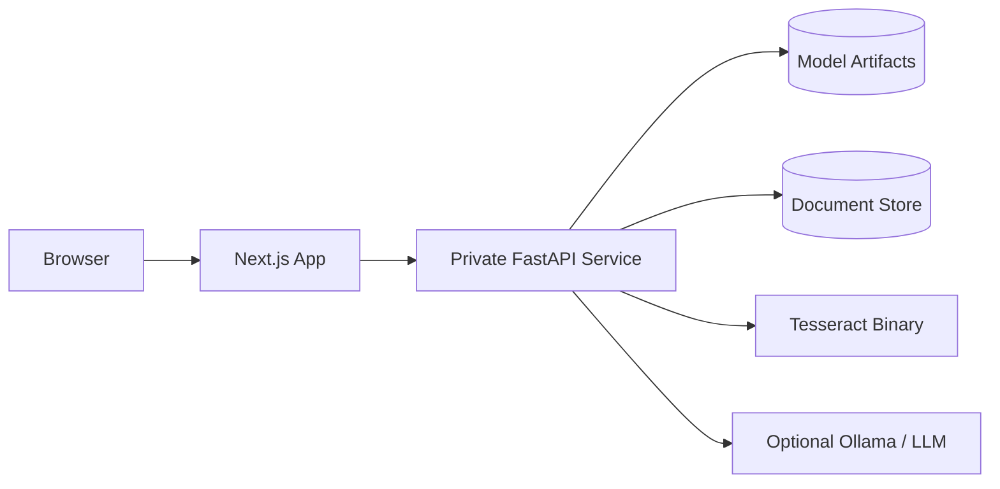

Deployment requirements:

1. Next.js must know `AGROSENSE_API_BASE`.
2. FastAPI must have access to `ML/models/`.
3. FastAPI must have write access to upload and vector-store directories.
4. Tesseract must be installed if photo/scanned-card OCR is required.
5. Torch, torchvision, pandas, scikit-learn, XGBoost, and LightGBM availability must match shipped artifacts.
6. FastAPI should not be exposed directly to the public internet unless authentication and CORS are deliberately added.

## 23. End-to-End Data Contract

### 23.1 Browser to `/api/card`

Form fields:

| Field | Type | Required | Notes |
| --- | --- | --- | --- |
| `card` | File | Yes | PDF, JPG, PNG, WEBP, TIFF, BMP accepted by backend route |

### 23.2 Browser to `/api/predict`

Form fields:

| Field | Type | Required | Notes |
| --- | --- | --- | --- |
| `documentId` | String | Yes | ID from card ingestion |
| `soil` | File | No | Soil photo, max 10 MB |
| `temperature` | Number/String | No | Defaults to 26.0 in backend |
| `humidity` | Number/String | No | Defaults to 68.0 in backend |
| `rainfall` | Number/String | No | Defaults to 110.0 in backend |
| `moisture` | Number/String | No | Defaults to 34.0 in backend |

### 23.3 FastAPI Prediction Output

| Field | Meaning |
| --- | --- |
| `soil` | Null if no photo; otherwise predicted soil, confidence, alternatives, note |
| `soil_applied` | Whether soil photo influenced crop ranking |
| `crops` | Ranked crop list |
| `fertilizers` | Ranked fertilizer list with `apply` or `hold` verdict |
| `readings_used` | N, P, K, pH, weather, and moisture values used |
| `needs_review` | True when card readings came from OCR |

## 24. Development Workflow

Recommended workflow for any new feature:

1. Read the relevant frontend/backend/ML file before editing.
2. Keep feature scope narrow.
3. If changing card extraction, add or update backend tests.
4. If changing model inputs, update training script, metadata, serving code, and TypeScript types together.
5. If changing frontend API shape, update `src/lib/cardTypes.ts`.
6. If changing model artifacts, restart FastAPI before testing because model loaders are cached.
7. Run `npm run api:test`.
8. Run `npm run lint` and `npm run build` before final handoff.
9. Update `ML_RESULTS.md` or this report when model metrics change.

## 25. What Is Already Done

| Item | Status |
| --- | --- |
| Soil training | Done |
| Soil model artifact | Present |
| Crop training | Done |
| Crop model artifact | Present |
| Fertilizer training | Done |
| Fertilizer model artifact | Present |
| Card ingestion endpoint | Present |
| Prediction endpoint | Present |
| Frontend proxy routes | Present |
| OCR strategy | Present |
| RAG indexing | Present |
| Marathi/English error handling | Present |

## 26. Recommended Next Tasks

1. Restore a sanitized `.env.example`.
2. Add `lightgbm` to backend dependencies if the shipped pickles are LightGBM.
3. Standardize `ML` versus `ml` path casing before any Linux deployment.
4. Update `ML_RESULTS.md` to match the current soil metadata, because the latest soil run improved over the older report.
5. Add a sandy soil dataset or remove sandy from classifier-facing expectations.
6. Add one scripted end-to-end test that ingests the fixture card and calls `/api/predict`.
7. Move local pickle document storage to a real database before multi-user deployment.
8. Keep fertilizer advice card-led and do not expose raw model probability as purchase confidence.

## 27. Quick Status Checklist

```text
[x] Soil model trained
[x] Soil classes saved
[x] Soil metadata saved
[x] Crop model trained
[x] Fertilizer model trained
[x] FastAPI prediction route exists
[x] Next.js prediction proxy exists
[x] Frontend upload flow exists
[ ] Sanitized env example restored
[ ] Path casing standardized
[ ] Dependency list checked for LightGBM
[ ] Production storage selected
```

