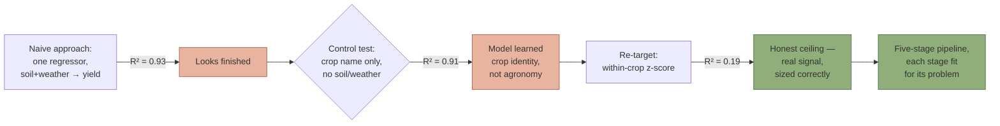
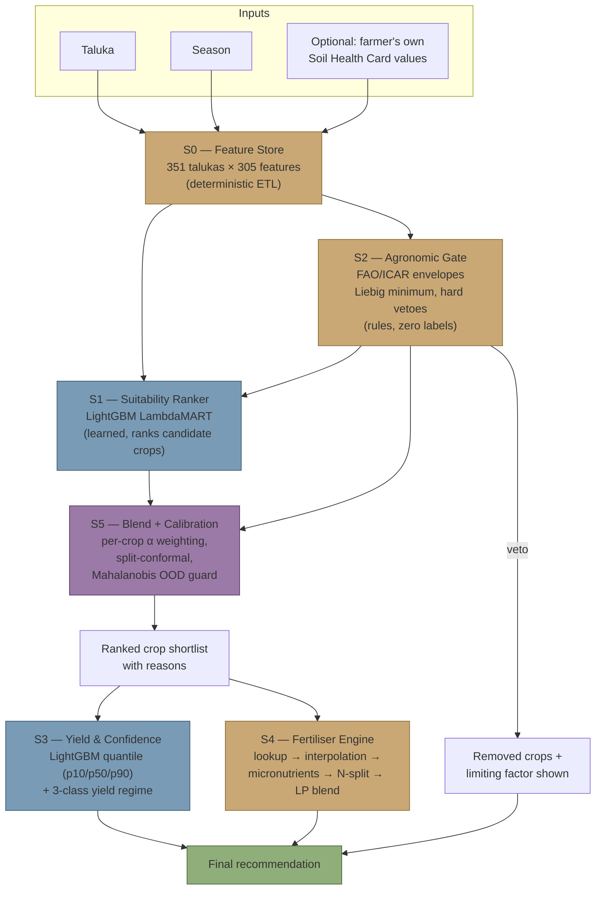
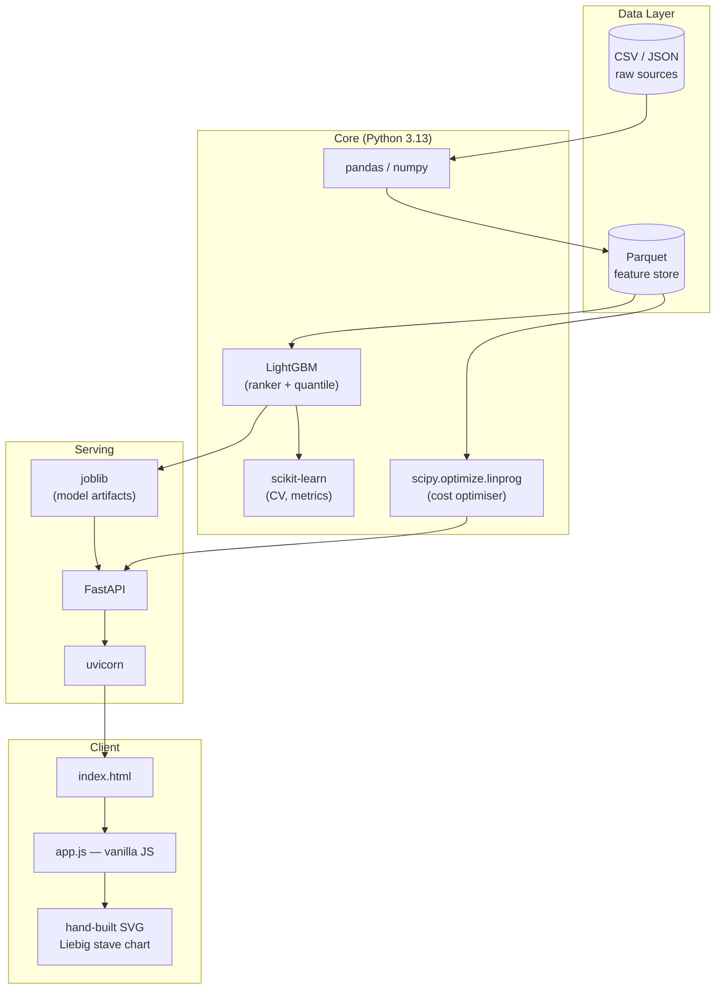
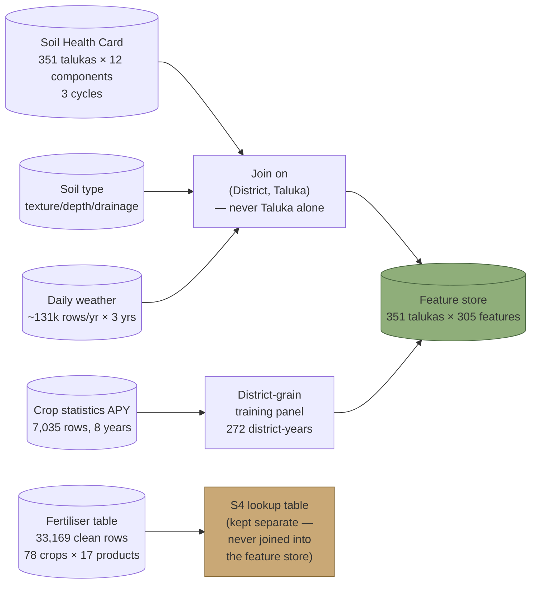
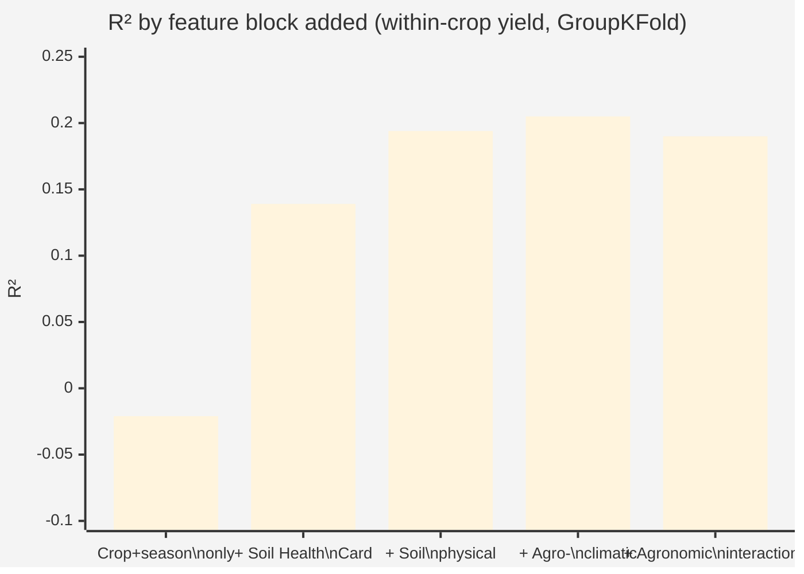
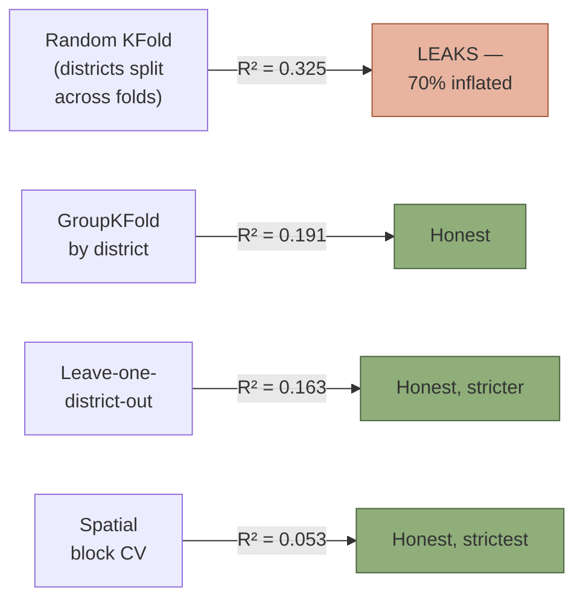
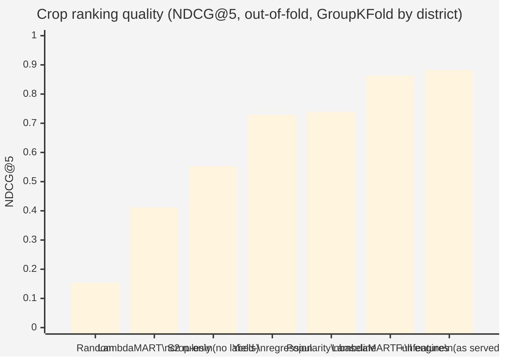
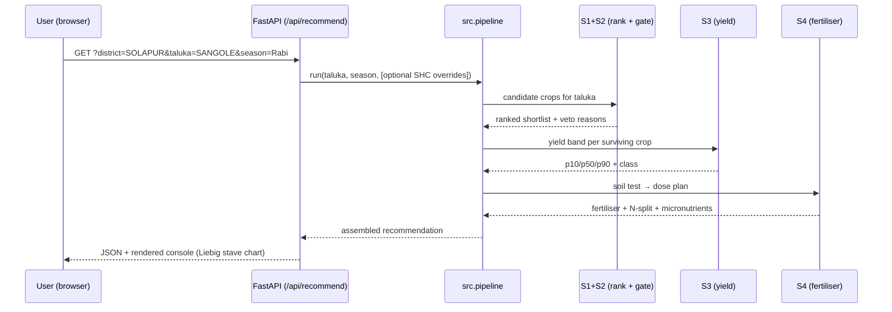
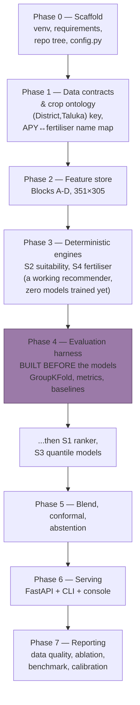

# GitHub.md — How I Built the Crop & Fertiliser Recommendation Engine

> **Stack line is out of date — 12 September 2026.** CatBoost now fits the ranking stage
> (LightGBM still fits yield), and the soil photograph is no longer a passive check: it is fused
> with the taluka soil survey and can change which crops are ranked. See
> [ML_PLAN.md §§5–6](ML_PLAN.md).

> **Project:** Regur — a crop & fertiliser recommendation engine for Maharashtra
> **Author:** Dishan Jadhav
> **Domain:** Applied ML / AgriTech — Soil Health Card data + agro-climatology + crop statistics
> **Stack:** Python 3.13 · LightGBM · scikit-learn · scipy · pandas · FastAPI · vanilla JS/SVG

This document explains **how** this project was built — the approach, the reasoning
behind every architectural choice, the exact tech stack and model hyperparameters,
the data used, the features engineered, how to reproduce it end-to-end, and where
it goes next. Diagrams and charts are included as Mermaid blocks (render natively
on GitHub).

---

## 1. The origin story — why this isn't a single model

The obvious approach to "recommend a crop and its fertiliser dose" is: train one
big classifier/regressor on soil + weather → crop, done. That approach was tried
first, as a benchmark, and it failed in an instructive way.

> A LightGBM model predicting raw `Yield` (t/ha) from soil + weather features
> scored **R² = 0.93**. A second model given **only the crop name and season** —
> no soil, no rainfall, no pH — scored **R² = 0.91**.

The model had learned that sugarcane yields ~74 t/ha and sesamum yields ~0.27
t/ha — arithmetic about crop identity, not agronomy. The honest, *within-crop*
signal (does this taluka's soil make sugarcane do better or worse than average
sugarcane land?) is **R² = 0.19**. That number — small, real, well above zero —
became the design constraint for everything downstream.

**Consequence for the architecture:** don't force every sub-problem into one
model. Use the technique that actually fits each stage.



---

## 2. Approach — five stages, five different techniques

| Stage | Component | Technique | Why this technique and not a model |
|:--|:--|:--|:--|
| **S0** | Taluka feature store | Deterministic ETL | 351 talukas × 305 engineered features from 18 raw files — must be reproducible, not learned |
| **S1** | Crop suitability ranker | **Learning-to-rank** (LambdaMART) | There's no single "correct" crop — 10–20 viable ones exist per taluka. Classification collapses that to one argmax label; ranking preserves the shortlist |
| **S2** | Agronomic gate & scorer | **Rules** (Liebig's law of the minimum) | Zero labels needed — FAO EcoCrop / ICAR envelopes veto what's agronomically impossible before any learned score is trusted |
| **S3** | Yield & confidence | **Quantile regression** | A point yield estimate is dishonest at R²=0.19; a p10/p50/p90 band plus a below/typical/above class is what the data actually supports |
| **S4** | Fertiliser engine | **Exact lookup** (deliberately not ML) | 33,169 clean rows of the government table were tested — **0 ambiguous keys**. It's a perfectly deterministic function; a model could only introduce error |
| **S5** | Conformal calibration | **Hybrid** (split-conformal + Mahalanobis OOD) | Turns a weak learned score into an honestly-calibrated one, and abstains rather than guessing when a taluka looks unlike anything trained on |



---

## 3. Tech stack

| Layer | Choice | Version |
|:--|:--|:--|
| Language | Python | 3.13 |
| Gradient boosting | LightGBM | 4.7.0 |
| Classical ML / metrics | scikit-learn | 1.9.0 |
| Optimisation (LP blend) | scipy | 1.18.1 |
| Data frames | pandas | 3.0.5 |
| Array ops | numpy | 2.5.2 |
| Columnar storage | pyarrow (parquet) | 25.0.1 |
| API server | FastAPI | 0.141.1 |
| ASGI server | uvicorn | 0.52.4 |
| Validation | pydantic | 2.13.4 |
| Model persistence | joblib | 1.5.3 |
| Testing | pytest | 9.1.1 |
| Plotting (reports) | matplotlib | 3.11.1 |
| Frontend (console) | vanilla JS + hand-built SVG | — |

No deep learning, no vector DB, no LLM — a deliberate choice. At an effective
sample size of ~34 districts, a heavier model architecture cannot help; feature
engineering and honest evaluation protocol dominate every architectural lever
tried (see §6).



---

## 4. Data — five public sources, joined at taluka grain

| Source | Grain | Size | Cycles/Years |
|:--|:--|:--|:--|
| **Soil Health Card (SHC)** | Taluka | 351 talukas × 12 soil components | 3 survey cycles |
| **Soil type** | Taluka | texture, depth, drainage, taxonomy | static |
| **Daily weather** | Taluka | ~131,000 rows/year | 3 agricultural years (2022–23, 2023–24, 2024–25, plus 2025-26 in repo) |
| **Crop statistics (APY)** | District | 7,035 district-crop-season records | 8 years, 2015-16 → 2022-23 |
| **Fertiliser recommendations** | Crop × district | 33,169 clean rows (of 41,070 total) | static govt. table, 78 crops, 17 products |

**The panel upgrade** (single biggest quality lever in the project): the original
plan was sized for **one** year of APY data (34 district-year label units, 1,000
labelled rows, 136 ranking queries). The delivered engine runs on **eight** years
(272 district-year units, 7,035 rows, 1,088 ranking queries) — verified in
[reports/multiyear_upgrade.md](../ml engine for Recommendation/reports/multiyear_upgrade.md).

Administrative geography changes are handled explicitly (never silently
absorbed as an agronomic signal):
- Palghar split from Thane in 2014
- Ahmednagar, Osmanabad, Aurangabad renamed in 2023
- SHC coverage grew 347 → 351 talukas with **zero** new talukas created (coverage change, not geography change)

**Data integrity check that mattered:** a delivered weather file named
`2022-23` was byte-identical to the `2025-26` file — a silent copy that would
have manufactured a false claim of contemporaneous weather. It was excluded,
and a test now asserts every weather file's internal dates match its filename.



### Data volume comparison

```mermaid
%%{init: {'theme':'base'}}%%
xychart-beta
    title "Panel size: one-year plan vs. eight-year delivered engine"
    x-axis ["District-year units", "Labelled crop rows (÷100)", "Ranking queries"]
    y-axis "Count" 0 --> 300
    bar [34, 10, 136]
    bar [272, 70, 1088]
```


*(Original plan in the first series, delivered eight-year panel in the second; labelled-row values divided by 100 to share an axis.)*

---

## 5. Features engineered — 305 per taluka, four blocks

| Block | Count | Examples |
|:--|--:|:--|
| **A — Soil health** | 51 | Nutrient Index (1–3), isometric log-ratio (ILR) on the L/M/H composition, `macro_NI`, `npk_imbalance`, `micro_def_count`, `ph_stress` |
| **B — Soil physical** | 13 | `awc_mm_m`, `depth_mm`, `drainage_ord`, `rootzone_awc = awc × depth / 1000` |
| **C — Agro-climatology** | 60 | Hargreaves ET₀ (FAO-56), aridity index `P/ET₀`, climatic water balance, LGP (length of growing period), GDD base 10, dry-spell length, monsoon onset, heat/cold days |
| **D — Interactions** | 20 | `water_supply`, `drought_vuln`, `leach_risk`, `zn_lockout`, `salinity_x_drain` |
| + climatology normals, panel history, district dispersion | rest | 3-year normals, inter-annual variability, SHC trend, revealed-preference history |

**Compositional data handling:** SHC L/M/H percentages sum to 100 by
construction — feeding all three raw parts into a model creates collinearity.
Treated correctly with **isometric log-ratio (ILR)** transforms.

**Hargreaves ET₀** was chosen over Penman-Monteith because the data has no
solar radiation field; validated against FAO-56's published worked example
(32.19 vs. 32.2 MJ/m²/day — 0.03% error).

**What feature engineering was worth, measured (not asserted):**



Feature engineering moved R² by **+0.23**. Every architectural lever tried
afterward (nested feature selection, stronger regularisation, DART, seed
bagging) moved it by at most **+0.010** — and heavy regularisation actively
hurt (down to 0.099). The Soil Health Card block alone delivers **68%** of the
achievable signal.

---

## 6. Models & hyperparameters

### S1 — Crop suitability ranker (`src/models/ranker.py`)

`LGBMRanker`, objective `lambdarank` — LambdaMART. Relevance labels are
`qcut(area_share.rank(), 5)` computed **within district** (revealed farmer
preference as a proxy for suitability).

| Parameter | Value | Note |
|:--|:--|:--|
| `objective` | `lambdarank` | learning-to-rank, not classification |
| `num_leaves` | 15 | sized for ~34 effective training samples |
| `min_child_samples` | 10 | |
| `learning_rate` | 0.05 | |
| `n_estimators` | **800** | measured +0.0116 NDCG@5 over 300, p=0.002, out-of-fold |
| `subsample` | 0.9 (freq 1) | |
| `colsample_bytree` | 0.7 | |
| `reg_lambda` | 1.0 | |

Groups = `(district, season)`; queries kept contiguous per LightGBM's group
API. 10-seed bagging averages out-of-fold predictions.

### S3 — Yield quantile regression (`src/models/yield_quantile.py`)

Three independent `LGBMRegressor` models, objective `quantile`, at
**α = 0.1 / 0.5 / 0.9**, trained on the **within-crop z-score** of yield
(never raw yield — that's what produces the fake R²=0.93). Converted back to
t/ha at serve time using each crop's own mean/std.

| Parameter | Value |
|:--|:--|
| `objective` | `quantile` |
| `num_leaves` | 15 |
| `min_child_samples` | 10 |
| `learning_rate` | 0.05 |
| `n_estimators` | 300 |
| `subsample` | 0.9 (freq 1) |
| `colsample_bytree` | 0.7 |
| `reg_lambda` | 1.0 |

Sample weights: `log1p(shc_samples_total)`, normalised — districts sampled
more often in the SHC survey are trusted more. Nested feature selection (top-k
by gain) happens **inside** each CV fold, never globally, to avoid leakage.
Quantiles are sorted per row post-hoc to restore monotonicity (p10 ≤ p50 ≤ p90).

### S5 — Blend & calibration (`src/models/blend.py`, `src/models/conformal.py`)

- **Blend weight α** per crop: derived from cross-validated **within-crop
  Spearman ρ of the ranker** (not the yield model — an earlier defect used the
  wrong model's skill and cost −0.063 NDCG@5). `α → 0` where ρ ≤ 0.2, and the
  rule scorer (S2) carries the recommendation alone.
- **Split-conformal** intervals, calibrated on a district-grouped holdout fold.
- **Mahalanobis distance** OOD guard: suppresses the learned score and serves
  S2 alone when a taluka is unlike anything trained on.

`final_score = α · rank_norm(S1) + (1 − α) · rank_norm(S2)`

### Evaluation protocol (non-negotiable, enforced by tests)

- **`GroupKFold(district)` everywhere** — never a random split.
- Feature selection happens **inside** each fold.
- The **out-of-fold popularity prior** is reported beside every ranking result
  as the bar to beat.
- `tests/test_no_leakage.py` asserts no district appears in both train and
  test of any fold, in any splitter.



---

## 7. Headline results

All numbers below are under **GroupKFold by district**; nothing is a random split.

### Ranking — the number that matters



The engine clears the popularity baseline — the honest bar, not "beats random"
— by **+0.143**.

### Calibration — checkable, not aspirational

| Interval | Nominal | Empirical coverage | Mean width |
|:--|--:|--:|--:|
| Raw quantile model | 80% | 0.704 | 1.80 |
| Split-conformal | 80% | **0.803** | 2.11 |
| Split-conformal | 90% | **0.901** | 2.70 |

### Yield ranking — the two crops the original plan called broken

| Crop | Spearman ρ, 1 year | Spearman ρ, 8 years |
|:--|--:|--:|
| Cotton (lint) | −0.33 | **+0.375** |
| Gram | −0.28 | **+0.285** |

Crops where the model was worse than useless (ρ < 0.2) fell from **10 of 25 to
2 of 28** with the eight-year panel — without ever adding an irrigation variable.

### Fertiliser engine

- 1,000 sampled keys reproduce the government table **byte-for-byte**, verified in CI every commit.
- The full table has **0 ambiguous keys** across 33,169 clean rows.
- The least-cost LP blend (`scipy.optimize.linprog`) was tested honestly and
  found to **not** beat the government's default option by more than
  ₹0.23/ha in 400 sampled cases — reported as a negative result rather than
  quietly dropped.

---

## 8. The console — how a recommendation is presented

`uvicorn src.serve.api:app` → `http://127.0.0.1:8000`. Pick a taluka and a
season, optionally paste in your own Soil Health Card numbers, and get:

- a ranked crop shortlist, with the reason each crop ranked where it did
- a p10/p50/p90 yield band plus a below/typical/above class
- an exact fertiliser dose, interpolated to the actual soil test
- a nitrogen split schedule based on leach risk
- micronutrient corrections the government table omits

**The Liebig stave chart** is the signature visual: S2's gate literally
computes `score = min(eight factors)`, and agronomy has illustrated that law
since 1840 with a barrel whose shortest stave sets the water level. The SVG
chart draws all eight staves, marks the shortest, colours it by severity — "why
this crop scored what it did" is the picture, not a caption.

Every query is a shareable URL: `?district=SOLAPUR&taluka=SANGOLE&season=Rabi`.



---

## 9. Reproducing the project end-to-end

```bash
# environment
python3.13 -m venv .venv
./.venv/bin/python -m pip install -r requirements.txt

# rebuild the feature store from raw files (one deterministic command)
./.venv/bin/python -m src.features.build_store

# get a recommendation from the CLI
./.venv/bin/python -m src.cli --district SOLAPUR --taluka SANGOLE --season Rabi

# regenerate the reports
./.venv/bin/python -m src.data.quality_report      # reports/data_quality.md
./.venv/bin/python -m src.eval.ablation            # reports/benchmark_results.md
./.venv/bin/python -m src.eval.experiments         # reports/experiments.md

# run the console
./.venv/bin/uvicorn src.serve.api:app --reload     # http://127.0.0.1:8000, /docs for API schema

# run the test suite
./.venv/bin/python -m pytest tests -q              # 178 tests
```

### Build order (how the phases actually happened)



The evaluation harness was built **before** the learned models specifically so
the validation scheme could never be retrofitted to flatter a result.

---

## 10. Repository layout

```
data/raw/                        the 5 source files, never modified
data/features/taluka_features.parquet    351 × 305, one command from raw

src/config.py                    paths, constants, thresholds — single source of truth
src/data/load.py                 loaders enforcing the (District, Taluka) contract
src/data/training_set.py         district-grain modelling frame, both targets
src/data/admin_changes.py        renames, splits, coverage onset
src/ontology/crop_map.py         APY <-> fertiliser name mapping

# deterministic — no training, fully testable
src/features/soil_health.py      Block A: nutrient index, ILR, composites
src/features/soil_physical.py    Block B: AWC, root-zone water
src/features/agroclimate.py      Block C: Hargreaves ET0, LGP, dry spells
src/features/interactions.py     Block D: leach risk, drought vulnerability
src/features/agronomic_fit.py    early fusion of S2 into S1 — label-free
src/features/climatology.py      3-year normals, inter-annual variability
src/rules/suitability.py         S2: Liebig minimum, hard vetoes
src/rules/fertiliser.py          S4: lookup, interpolate, micronutrients, splits
src/rules/cost_optimiser.py      S4: scipy linprog

# learned
src/models/ranker.py             S1: LGBMRanker, lambdarank
src/models/yield_quantile.py     S3: alpha = .1/.5/.9
src/models/conformal.py          S5: split-conformal + Mahalanobis OOD guard
src/models/yield_class.py        S3b: below / typical / above tercile
src/models/blend.py              S5: per-crop alpha weights

# evaluation
src/eval/splits.py               GroupKFold, LODO, spatial blocks, forward chaining
src/eval/metrics.py              NDCG@k, P@k, within-crop rho, coverage
src/eval/baselines.py            random, popularity prior, rules-only
src/eval/ablation.py             -> reports/benchmark_results.md
src/eval/experiments.py          -> reports/experiments.md

src/pipeline.py                  the five stages wired together
src/serve/api.py                 FastAPI + serves the console at /
src/serve/static/                index.html · app.css · app.js  (the console)
src/cli.py                       same pipeline, no server
tests/                           178 tests
```

---

## 11. What this system deliberately does not claim

- **Weather is the wrong year for the yield labels.** Used strictly as a
  climatology descriptor ("what this place is typically like"), never as a
  causal weather-response signal.
- **Effective sample size is ~34, not thousands of rows.** Every modelling
  decision (leaf count, regularisation, feature-selection budget) is sized for
  that, not for the raw row count.
- **Area share is not pure agronomy** — it's confounded by irrigation access,
  MSP policy and sugar co-operative politics.
- **The model fails openly on some crops** — cotton and gram were, and where
  ranker skill (ρ) is too low the blend routes to rules alone rather than
  pretending otherwise.
- **Suitability is rainfed by default** unless `--irrigated` is passed.
- **FAO/ICAR agronomic envelopes are encoded from references but not yet
  verified line-by-line against primary sources** — flagged as the next
  priority, not silently assumed correct.

---

## 12. Future scope

1. **Multi-year APY expansion** (data.gov.in, back to 1997) — every weak
   result in the current benchmark is a symptom of a still-small effective
   sample; more years compounds the single highest-value lever already proven
   here (8 years vs. 1 moved the ranking margin from +0.083 to +0.122).
2. **Multi-year daily weather** (IMD Pune) — removes the weather/crop
   year-mismatch entirely and enables a true 30-year climatology instead of a
   3-year one.
3. **Irrigation coverage by taluka** — the single biggest missing confounder;
   cotton and gram's earlier negative correlation is irrigation- and
   market-determined, and there is currently no irrigation variable at all.
4. **Market price data** (Agmarknet) — would let the ranker optimise gross
   margin per hectare instead of yield or area share; farmers optimise rupees,
   not tonnes.
5. **Line-by-line verification of the FAO EcoCrop / ICAR envelopes** against
   primary agronomic sources, rather than the current best-effort encoding.
6. **A mobile-first / offline-capable client** for field use where
   connectivity is poor, reusing the same FastAPI backend.
7. **Regional-language output** beyond the existing Marathi crop names —
   full recommendation text localisation.
8. **Model monitoring in production** — drift detection on the feature store
   inputs and periodic re-validation of the conformal coverage guarantee as
   new SHC cycles and APY years arrive.

---

*Every number in this document is reproducible from the repository with the
commands in §9 — `pytest tests -q` and `python -m src.eval.ablation` regenerate
all of them.*
