# AgroSense: A Grounded, Multi-Model Decision-Support System for Maharashtra Farmers Combining Soil Health Cards, Soil Imagery, Taluka Agro-Climatology and Agentic LLM Research on AWS

**Dishan Jadhav**¹, *[Co-author / Guide name]*²

¹ *[Department, Institution, City, India — email]*
² *[Department, Institution, City, India — email]*

> **Manuscript status.** Prepared in the IEEE conference structure (IEEEtran). Every quantitative claim below is taken from the project's own artifacts — `ML/models/*.json` (soil models), `ML/data/soil_v2/manifest.json`, `ml engine for Recommendation/artifacts/*` and `reports/*` (engine), `terraform/` (deployment), the service source code — or from end-to-end runs recorded on 3 October 2026. Figures are Mermaid diagrams; export them to SVG/PDF with `mermaid-cli` for the IEEEtran `figure` environment. Placeholders in *[brackets]* must be completed before submission, and every reference should be checked against its publisher record.

---

## Abstract

Soil Health Cards (SHCs) give Indian farmers laboratory measurements of twelve soil parameters, yet most farmers receive no actionable interpretation of them. We present **AgroSense**, a bilingual (Marathi/English) decision-support system that turns a farmer's own SHC, a photograph of their soil, and their taluka and season into crop and fertilizer recommendations whose every input is supplied by the farmer and whose every output carries its provenance. The system combines (i) SHC ingestion that treats OCR as a search over eight configurations, merges readings across passes, requires farmer confirmation and indexes the card for owner-scoped retrieval; (ii) an eight-class EfficientNet-B0 soil classifier trained under scene-grouped cross-validation after a de-duplication pipeline that reduced 2,575 delivered images to 707 distinct scenes; (iii) a six-stage taluka-level recommendation engine over 351 talukas that blends a learned LambdaMART ranker with an agronomic Liebig gate, conformal yield intervals, an out-of-distribution guard, a Bayesian fusion of the soil photograph with the soil survey, and a fertilizer-dose pipeline ending in a least-cost linear program; (iv) a four-agent research pipeline (Planner, Research, Creator, Reviewer) that gathers sourced, current information through five Model Context Protocol (MCP) tool servers under a code-enforced source policy; and (v) a streaming farmer assistant grounded in the farmer's own result. All language-model calls run on Amazon Nova Pro through Amazon Bedrock, behind a Bedrock Guardrail, on a defence-in-depth AWS deployment of three Fargate services and one Lambda function expressed in Terraform. The soil classifier reaches a macro-F1 of 0.766 ± 0.038 with an expected calibration error of 0.045; the engine reaches NDCG@5 = 0.829 under forward-chaining evaluation against 0.717 for a popularity prior. We also report three failure modes found in the course of the work — evaluation leakage through duplicated images, leakage through a warm-start checkpoint, and a categorical-to-continuous mismatch in salinity handling — and the corrections applied.

**Index Terms** — precision agriculture, soil health card, OCR, soil image classification, crop recommendation, learning to rank, calibration, retrieval-augmented generation, LLM agents, Model Context Protocol, Amazon Bedrock, cloud security.

---

## I. Introduction

India's Soil Health Card scheme issues farmers a printed or digital report of twelve soil parameters — pH, electrical conductivity (EC), organic carbon (OC), available nitrogen (N), phosphorus (P), potassium (K), sulphur (S), zinc (Zn), iron (Fe), manganese (Mn), copper (Cu) and boron (B) — each judged against a printed range [1]. The card answers *what is in the soil*; it does not answer the farmer's actual questions: *what should I grow this season, which fertilizer should I buy, and how much?* Maharashtra alone has 351 surveyed talukas spanning the high-rainfall Konkan coast, the rain-shadow plateau east of the Western Ghats and the wetter east of Vidarbha, so a single state-wide answer is wrong almost everywhere.

Existing crop-recommendation tools typically train a classifier on a small public table and present its top class as advice. Three problems recur. First, **invented inputs**: when a value is missing, a default is silently substituted, so the answer looks personal but is computed for an average field. Second, **leaky evaluation**: image datasets assembled from the web contain the same photograph many times, and random splits place copies on both sides, inflating reported accuracy. Third, **ungrounded language models**: chat assistants answer agronomy questions from generic training data and invent prices, schemes and doses.

AgroSense is designed around the opposite commitments. Every model input comes from the farmer; a blank is an error, never a default. Every evaluation is grouped so that no copy of a validation image is ever trained on. Every language-model answer is grounded in the farmer's own computed result and in sourced research, and is filtered by a guardrail.

**Contributions.**

1. An **SHC ingestion pipeline** that treats OCR as a search over eight Tesseract configurations scored by how many of the twelve readings they recover, merges rows across passes (12 of 12 readings where the best single pass reads 11), rejects implausible values, and indexes the card for retrieval scoped to its owner.
2. A **leakage-free soil-image pipeline** — exact (MD5) and perceptual (dihedral pHash) de-duplication with union-find scene grouping and label-conflict removal — and an eight-class, temperature-calibrated EfficientNet-B0 classifier evaluated by scene-grouped cross-validation, compared against three earlier arms and two earlier generations.
3. A **deficit-driven fertilizer ranker** that places the farmer's measured nutrient status in front of a fertilizer classifier whose accuracy (17.5 %) is barely above chance (14.3 %).
4. A **taluka × season recommendation engine** combining a learned ranker, an agronomic gate based on Liebig's law of the minimum, conformal yield intervals, out-of-distribution abstention, Bayesian fusion of the soil photograph with the soil survey, and a dose pipeline that interpolates state recommendation tables by the farmer's card and solves for the least-cost product mix.
5. An **agentic research pipeline** of four cooperating agents with five MCP tool servers, a code-enforced source policy and a structured-output adapter that runs the OpenAI Agents SDK orchestration on Amazon Nova Pro.
6. A **grounded bilingual farmer assistant** that streams answers explained by the specific inputs that produced the farmer's result, under a Bedrock Guardrail.
7. A **defence-in-depth AWS architecture** (CloudFront + WAF, origin-verified ALB, private service mesh, per-service IAM, KMS, CloudTrail, GuardDuty, Access Analyzer) expressed entirely in Terraform.
8. Three documented **failure analyses** — duplicate-image leakage, warm-start leakage, and a salinity category error that emptied recommendations — with their corrections.

---

## II. Related Work

**Crop and fertilizer recommendation.** Tabular classifiers — random forests, gradient-boosted trees such as XGBoost [2], LightGBM [3] and CatBoost [4] — trained on public crop-recommendation tables are the common baseline. They typically take N, P, K, temperature, humidity, pH and rainfall and output one crop. Two weaknesses motivate our design: the tables' N/P/K columns are frequently not soil measurements at all (in the widely used crop-recommendation table they encode crop fertilizer doses), and a single top-1 label ignores the land's suitability constraints that agronomists formalise in land-evaluation frameworks [5], [24].

**Learning to rank.** Recommending *which crops, in what order* is a ranking problem. LambdaMART [6] optimises ranking metrics such as NDCG directly and is supported by modern gradient-boosting libraries [3], [4].

**Soil image classification.** Convolutional networks — ResNet [7] and the compound-scaled EfficientNet family [8] — are standard for soil-type recognition from photographs. Published accuracies are often measured on randomly split, web-scraped sets; perceptual hashing [9] is a cheap way to find the near-duplicates that make such splits optimistic.

**Calibration.** Modern networks are over- or under-confident; temperature scaling [10] is a one-parameter post-hoc fix, and expected calibration error (ECE) measures the residual gap. Calibration matters when a confidence is shown to a person making a purchase.

**Uncertainty and abstention.** Conformal prediction [11] gives distribution-free intervals with a coverage guarantee; distance-based detectors such as the Mahalanobis distance [12] flag inputs unlike the training data.

**Document reading and retrieval.** Tesseract [19] is the standard open OCR engine; retrieval-augmented generation (RAG) [13] grounds answers in retrieved passages, and feature hashing [25] gives a fixed-size, training-free text representation.

**LLM assistants and agents.** ReAct [14] interleaves reasoning with tool use. The Model Context Protocol (MCP) [15] standardises how tools are exposed to models. The Amazon Nova family [16] provides multilingual foundation models on Amazon Bedrock, and Bedrock Guardrails [26] apply content and PII policies outside the model.

**Gap.** We found no system that combines the farmer's own SHC, a calibrated soil-photo model, taluka-level agro-climatology and a grounded, guardrailed assistant — with leakage-free evaluation and an explicit no-invented-inputs rule. Table I summarises the comparison.

**TABLE I. Comparison with typical approaches**

| Capability | Typical crop-recommendation app | Generic LLM chatbot | **AgroSense** |
|---|---|---|---|
| Uses the farmer's own SHC | Partial (manual N/P/K) | No | **Yes — 12 parameters via OCR, farmer-confirmed** |
| Missing input handling | Silent defaults | Not applicable | **Error naming the field** |
| Soil from a photograph | Rare | No | **8-class CNN, calibrated, scene-grouped CV** |
| Location-specific (taluka, season) | Rarely | No | **351 talukas × season engine** |
| Suitability constraints (pH, salinity, depth, water) | No | No | **Liebig gate with explicit veto reasons** |
| Fertilizer quantity | Fixed table or none | Invented | **State table, interpolated by the card, least-cost mix** |
| Uncertainty shown | No | No | **Calibrated confidence, conformal yield bands, OOD abstention** |
| Current, sourced information | No | Unsourced | **Agent research through MCP tools with a code-enforced source policy** |
| Explains *why* | No | Generic | **From the specific inputs that drove the result** |
| Language | English | Varies | **Marathi-first, English** |
| Safety controls | None | Provider defaults | **Bedrock Guardrail + WAF + per-user quotas** |

---

## III. System Architecture

AgroSense is a three-service web application with a scheduled research function (Fig. 1). Only the web service is reachable from the internet; the browser never calls the reading service or the engine.

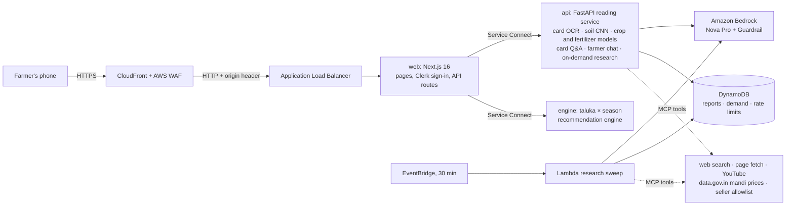

*Fig. 1. System architecture. The reading service and the engine have no public route.*

**TABLE II. Components and technologies**

| Component | Responsibility | Technology |
|---|---|---|
| Web app | Bilingual UI, Clerk authentication, server-side API routes, streaming chat proxy | Next.js 16 (App Router), React, TypeScript, Tailwind CSS v4 |
| Reading service | SHC ingestion and OCR, card retrieval index, soil classifier, crop and fertilizer models, card Q&A, chat, on-demand research queue | Python, FastAPI, PyTorch/torchvision, LightGBM, XGBoost, scikit-learn, Tesseract, PyMuPDF |
| Recommendation engine | Taluka feature store, learned ranker, agronomic gate, yield models, conformal intervals, soil fusion, fertilizer doses, least-cost optimiser | Python 3.13, CatBoost, LightGBM, scikit-learn, SciPy, pandas |
| Research agents | Planner, Research, Creator, Reviewer; five MCP tool servers | OpenAI Agents SDK orchestration on Amazon Nova Pro via a Converse adapter; MCP (stdio) |
| Language models | Agents, chat, card answers | Amazon Bedrock — `apac.amazon.nova-pro-v1:0` |
| Infrastructure | Compute, network, storage, security | ECS Fargate (ARM64), Lambda, CloudFront, WAF, DynamoDB, S3, KMS, CloudTrail, GuardDuty, Terraform |

**TABLE III. Service interfaces**

| Browser calls (web) | Forwarded to | Purpose | Sign-in | Daily quota per user |
|---|---|---|---|---|
| `POST /api/card` | api `POST /api/ingest` | Read and index a Soil Health Card | Yes | 20 |
| `POST /api/soil` | api `POST /api/soil` | Classify a soil photograph | Yes | — |
| `GET /api/recommend/meta` | engine `/talukas`, `/atlas`, `/seasons` | Map, taluka list, seasons | No | — |
| `POST /api/recommend` | engine `POST /recommend` | Crops, vetoes, doses, yield band | Yes | — |
| `POST /api/chat` | api `POST /api/chat` | Streaming assistant (NDJSON) | Yes | 80 messages |
| `GET /api/insights/{category}/{slug}` | api, same path | Agent research report for a topic | No | — |
| `POST /api/predict` | api `POST /api/predict` | Card-only crop and fertilizer path (Section V-C) | Yes | 20 |
| — | api `POST /api/ask` | Question answering over the farmer's own card | Yes | 50 |
| `GET /api/health` | — | Load-balancer health check | No | — |

The web routes attach a server-held service key and the Clerk session; the reading service verifies both, so a request cannot reach it with a browser's credentials alone.

**Design principles.** (P1) *No invented inputs* — a missing model input is an error naming the field. (P2) *Provenance* — every reading is labelled as coming from the farmer's card or from the taluka average. (P3) *Calibrated confidence* — a percentage shown to a farmer must mean what it says. (P4) *Honest abstention* — the system says when it is outside what it learned. (P5) *Marathi first*, readable outdoors on low-cost Android phones.

The farmer's journey in the current web application is shown in Fig. 2.

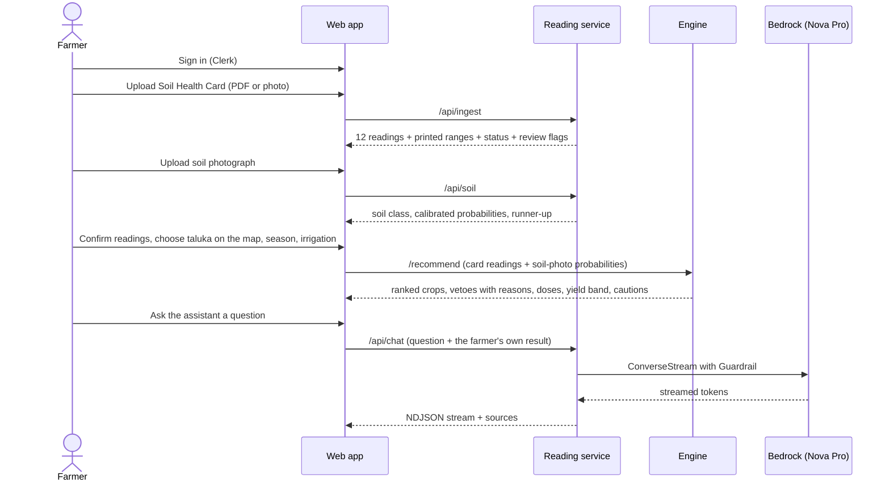

*Fig. 2. End-to-end farmer workflow.*

---

## IV. Data

**TABLE IV. Datasets**

| Dataset | Size | Use |
|---|---|---|
| Soil photographs, 8 classes (alluvial, black, cinder, clay, laterite, peat, red, yellow) | 2,575 files → 1,674 distinct by MD5 → 707 scenes | Soil classifier |
| Crop-recommendation table [17] | 2,200 rows, 22 crops | Crop model (temperature, humidity, pH, rainfall) |
| Fertilizer table (Kaggle Playground Series S5E6) [18] | 750,000 rows, 7 fertilizers | Fertilizer tie-breaker |
| Soil Health Card taluka distributions | 351 talukas × 3 cycles (2023-24, 2024-25, 2025-26) | Engine feature store |
| Area–production–yield (APY) crop statistics | 8 years (2015-16 → 2022-23), 7,035 labelled rows, 34 districts | Ranker and yield labels |
| Daily taluka weather | 29 years | Climatology, as-of normals |
| Taluka soil survey | Soil orders and physical properties per taluka | Agronomic gate, fusion prior |
| State fertilizer recommendation tables | Per crop × fertility class × context | Engine doses |
| Sample Soil Health Cards | 3 real-format cards (+ scanned variants) | OCR and end-to-end tests |

**Data-quality findings.** The soil image set required substantial cleaning (Section V-B): 901 of 2,575 files (35 %) were byte-identical copies; near-duplicates (rotations, re-crops, burst frames) reduced 1,674 distinct images to 707 scenes; 68 of the 700 retained scene groups straddled the delivered train/test split; and seven groups carried the same pixels under two different labels. A probe classifier trained on image *dimensions alone* predicted the soil class with 38.7 % accuracy against a 17.4 % majority baseline — four of the eight classes arrive almost entirely at 640 × 640 pixels — so resolution had to be normalised to prevent the network learning the source instead of the soil. Finally, a separately supplied four-soil folder of 1,717 photographs proved to be a byte-identical subset of the training folder, so it could not serve as an independent test set (Sections V-B and VII).

---

## V. Methodology

### A. Soil Health Card ingestion and retrieval

The card is the system's most trusted input and its hardest to read: farmers photograph it far more often than they export a PDF, at angles, in shade, on cracked screens. Ingestion therefore has three goals — read all twelve readings, never accept a reading that cannot be true, and never let an OCR guess reach a model unconfirmed — and one side product: an index of the card for retrieval (Fig. 3).

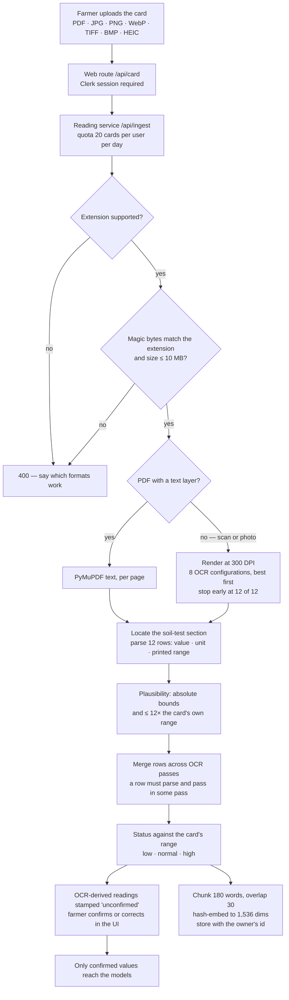

*Fig. 3. Soil Health Card ingestion.*

#### 1) File checks

The extension chooses the reader and is checked first because it is free. After the bytes are stored, their first 16 bytes must match the claimed type (`%PDF-`, JPEG, PNG, GIF, BMP, TIFF, WebP or ISO-BMFF signatures), so a `.pdf` that is really HTML is refused before any OCR is spent on it. Empty files and files over 10 MB are refused; a card that cannot be read is deleted rather than kept. Every stored card carries the Clerk user id of its owner, which is required — there is no default.

#### 2) OCR as a search

A PDF with a text layer is read directly with PyMuPDF. A scanned page is rendered at 300 DPI, and a photograph is read as is; both go to a multi-pass reader. Each pass is a preprocessing mode followed by Tesseract [19] with a page-segmentation mode and a language pack (Table V). Every pass is *scored* by the only measure that matters — how many of the twelve readings the parser recovers from its text — and the reader stops at the first pass that reaches 12. Because no single pass is reliably complete and passes drop different rows, the parser then merges rows across all passes; a row is accepted only if, in some pass, it parsed with a range and passed the plausibility bounds, so merging can recover a dropped row but cannot invent one.

**TABLE V. OCR configurations (in order) and their complementary recall**

| Pass | Preprocessing | Tesseract PSM | Languages |
|---|---|---|---|
| scaled/psm6 | greyscale + autocontrast, upscaled to 2,400 px wide if narrower (≤ 4×) | 6 (uniform block) | eng+mar |
| plain/psm6 | greyscale + autocontrast | 6 | eng+mar |
| boost/psm6 | greyscale + autocontrast, ×1.6 | 6 | eng+mar |
| scaled/psm4 | as scaled | 4 (single column) | eng+mar |
| boost/psm4 | as boost | 4 | eng+mar |
| scaled/psm6/eng | as scaled | 6 | eng |
| binary/psm6 | greyscale + autocontrast, threshold at 160 | 6 | eng+mar |
| plain/psm3 | as plain | 3 (automatic) | eng+mar |

| Readings recovered from a high-resolution photograph of a fixture card | of 12 |
|---|---|
| scaled/psm6 (missing N, OC, S, Cu) | 8 |
| boost/psm6 (missing OC, S, Cu) | 9 |
| binary/psm6 (missing OC, Cu) | 10 |
| scaled/psm6/eng (missing Cu) | 11 |
| **All passes merged** | **12** |

#### 3) Parsing, plausibility and status

The parser locates the soil-test section between known start and end markers, normalises dashes and line breaks, and matches each of the twelve parameters to a value, unit and printed range. Two checks reject values that parse but cannot be true (Table VI): an absolute physical bound per parameter, and a *relative* bound — a reading more than 12× outside the range printed on that same card is more likely a lost decimal point than a soil (OCR reads copper 2.47 as 34 or 47, inside the absolute bound but 17× the card's ceiling, while real soils on the fixtures sit at most 1.6× outside). Implausible rows are kept internally only as evidence for choosing between disagreeing passes and never shown. Status is computed against the range printed on the card (*below / within / above*), and is recomputed whenever the farmer corrects a value.

**TABLE VI. The twelve card parameters and their plausibility bounds**

| Parameter | Unit | Absolute bound | Parameter | Unit | Absolute bound |
|---|---|---|---|---|---|
| pH | — | 2 – 12 | Available S | ppm | 0 – 500 |
| EC | dS/m | 0 – 20 | Available Zn | ppm | 0 – 100 |
| Organic carbon | % | 0 – 10 | Available Fe | ppm | 0 – 500 |
| Available N | kg/ha | 0 – 2,000 | Available Mn | ppm | 0 – 500 |
| Available P | kg/ha | 0 – 500 | Available Cu | ppm | 0 – 100 |
| Available K | kg/ha | 0 – 2,000 | Available B | ppm | 0 – 50 |

A number recovered from pixels is not the same fact as a number read from a text layer. On a clean render of one fixture card Tesseract reads nitrogen 245.15 as 945.15 — in range, plausible, and enough to turn "low, apply urea" into "high, apply none". Nothing downstream can detect that from the text, so every OCR-derived reading is stamped *unconfirmed*, the card is flagged for review, and the farmer confirms or corrects the values that feed the models; what runs is what the farmer confirmed.

#### 4) Retrieval over the farmer's own card

The card's pages are split into overlapping word windows, embedded and stored with the card's metadata, including its owner. Questions about the card follow the path in Fig. 4.

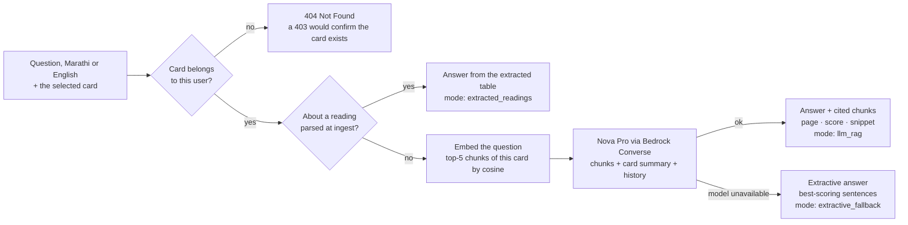

*Fig. 4. Question answering over the farmer's card (retrieval-augmented generation).*

The ownership check runs *before* any embedding is queried: asking questions of somebody else's card is the same disclosure as reading it, and the answer is 404 rather than 403 so that a probe cannot even confirm that a card exists. A question about a specific reading is answered straight from the parsed table — the one path that cannot invent or misquote a number. Otherwise the top chunks go to the model with the card's summary and the conversation history, and if the model is unreachable the service still answers with the highest-scoring sentences from the retrieved chunks (Table VII).

**TABLE VII. Card retrieval: parameters and answer modes**

| Setting | Value | Reason |
|---|---|---|
| Chunking | 180 words, 30-word overlap, per page | A card row and its range stay in one chunk |
| Embedding | Feature hashing [25], 1,536 dimensions, English stop words removed, L2-normalised | No model to host or download; deterministic; Devanagari tokens hash like any other |
| Similarity | Dot product of normalised vectors (cosine), one matrix multiply | Cards are small; no approximate index needed |
| Scope | Only the selected card's chunks | Retrieval is per owner, per card |
| Top-k | 5 | — |
| Answer model | Amazon Nova Pro (Converse), temperature 0.2, ≤ 1,200 tokens | Same model as the agents and chat |

| Answer mode | When |
|---|---|
| `extracted_readings` | The question names a parsed reading — answered from the table |
| `llm_rag` / `llm_general` | Model answer with / without retrieved chunks |
| `extractive_fallback` | Model unavailable, chunks available |
| `llm_unavailable` / `no_context` | Neither — an explicit message, never a fabricated answer |

In the current web application the card's readings reach the assistant (Section V-G) as structured context rather than through this index; `/api/ask` remains the service's retrieval interface over the card's text.

### B. Soil image classifier

#### 1) De-duplication and grouping

Let $\mathcal{I}$ be the delivered files. Exact duplicates are collapsed by MD5. For each remaining image $x$, a 64-bit DCT perceptual hash is computed over the eight dihedral transforms $g \in D_4$ and the numerically smallest is kept,

$$h(x) = \min_{g \in D_4} \operatorname{pHash}(g \cdot x),$$

so a rotated or mirrored copy shares its original's hash [9]. Images $i, j$ are unioned into one scene when $d_H(h_i, h_j) \le \tau$ with $\tau = 6$ bits, and additionally when their normalised filename stems match *within one class directory* (numeric-only stems are excluded: four classes number their files `1.jpg, 2.jpg, …`, and two `21.jpg` files in different folders are 24–30 bits apart, i.e. different photographs). Groups whose members carry more than one label are dropped. Folds are then built with `StratifiedGroupKFold` [20] ($k = 5$), so every copy of a scene lands in exactly one fold (Fig. 5).

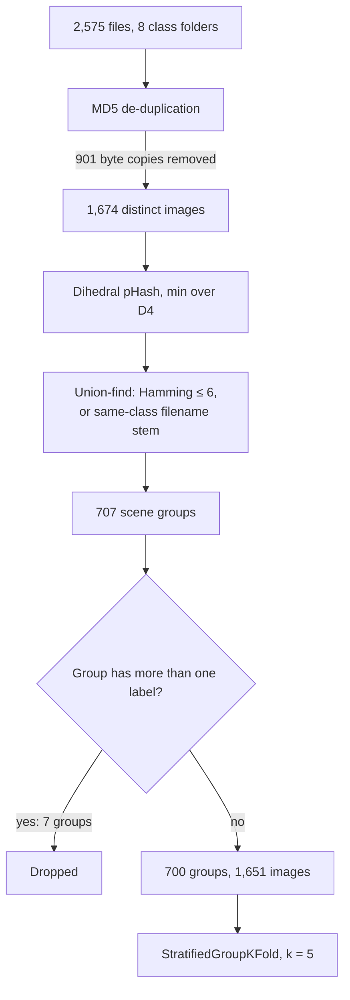

*Fig. 5. Leakage-free dataset construction.*

**TABLE VIII. Images and scenes per class (served dataset)**

| Class | Images | Scenes | Survey order it maps to |
|---|---|---|---|
| Alluvial | 288 | 104 | Alluvial |
| Black | 120 | 110 | Black (Regur) |
| Cinder | 223 | 79 | — (no survey order) |
| Clay | 115 | 75 | — |
| Laterite | 266 | 75 | Laterite |
| Peat | 228 | 72 | — |
| Red | 155 | 114 | Red & Yellow |
| Yellow | 256 | 71 | Red & Yellow |

The imbalance is in images, not scenes: black soil has the fewest images but the most distinct scenes after red, while yellow and peat arrive as many near-copies of few scenes.

#### 2) Model and training

EfficientNet-B0 [8] initialised from ImageNet is fine-tuned with a two-epoch warm-up of the classification head (learning rate $10^{-3}$) followed by unfreezing the last three backbone stages (learning rate $10^{-5}$), for 18 epochs per fold, batch size 32, weight decay $10^{-4}$, label smoothing 0.08 and mixup ($\alpha = 0.2$) [22]. Augmentation resizes every image to 255 px before a random resized crop (scale 0.6–1.0) to 224 px, applies a *resolution jitter* (down-sampling by a random factor in [0.35, 1] and back, p = 0.5) to break the image-size shortcut, flips in both axes, colour jitter and random erasing. Class-balanced sampling counters the 2.5 : 1 imbalance between the largest and smallest classes. Evaluation uses a resize to 255 px, a 224-px centre crop and horizontal-flip test-time augmentation — identical to the serving path (Fig. 6).

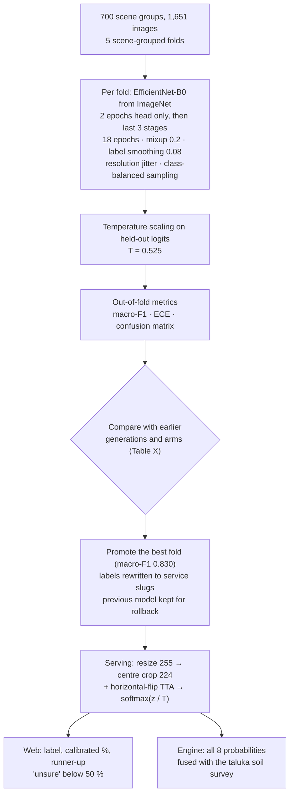

*Fig. 6. Soil classifier: training, calibration, comparison, promotion and serving.*

**TABLE IX. Training configuration by generation**

| Setting | G1 (Aug 2026) | G2 (Sep 2026) | G3 — served (3 Oct 2026) |
|---|---|---|---|
| Source folder | 8-class folder | 4-soil folder (subset of the 8-class folder) | 8-class folder |
| De-duplication / grouping | None | MD5 + dihedral pHash scenes | MD5 + dihedral pHash scenes |
| Folds | 5, not grouped | 5, scene-grouped | 5, scene-grouped |
| Epochs (warm-up) | 12 (2) | 18 (2) | 18 (2) |
| Resolution normalisation and jitter | No | Yes | Yes |
| Arms | EfficientNet-B0, ResNet-18 | EfficientNet-B0, ResNet-18, EfficientNet-B0 warm-started from G1 | EfficientNet-B0 (warm start refused) |
| Head / backbone learning rate | $10^{-3}$ / $10^{-5}$ | same | same |
| Label smoothing, mixup, unfrozen stages, TTA | 0.08, 0.2, 3, yes | same | same |
| Temperature | 0.470 | 0.316 | 0.525 |

#### 3) Calibration

A temperature $T$ is fitted on held-out logits $z$ by minimising negative log-likelihood, and served probabilities are $\operatorname{softmax}(z/T)$ [10]. Calibration is measured by

$$\mathrm{ECE} = \sum_{b=1}^{B} \frac{|S_b|}{n}\,\bigl|\operatorname{acc}(S_b) - \operatorname{conf}(S_b)\bigr|.$$

The shipped model has $T = 0.525$ (the raw network was under-confident after label smoothing and mixup).

#### 4) Generations and architectures compared

Three generations of the classifier exist; Table X lists every arm that was trained. The numbers are *not* a leaderboard: the protocols differ, and two of the higher figures are known to be inflated.

**TABLE X. Soil classifier generations and architectures (5-fold CV)**

| Gen. | Classes | Scenes | Arm | Macro-F1 | Accuracy | ECE | Checkpoint | Outcome |
|---|---|---|---|---|---|---|---|---|
| G1 | 8 | not grouped | EfficientNet-B0 | 0.906 ± 0.013 | 0.912 | — | 16.2 MB | Served until 3 Oct; kept for rollback. **Inflated**: copies of validation photographs were in training |
| G1 | 8 | not grouped | ResNet-18 | 0.905 ± 0.012 | 0.910 | — | 44.8 MB | Not chosen: equal score, 2.8× the size |
| G2 | 4 | 393 | EfficientNet-B0 | 0.872 ± 0.041 | 0.870 | 0.068 | 16.2 MB | — |
| G2 | 4 | 393 | ResNet-18 | 0.875 ± 0.023 | 0.877 | 0.057 | 44.8 MB | — |
| G2 | 4 | 393 | EfficientNet-B0, warm start from G1 | 0.891 ± 0.036 | 0.893 | 0.054 | 16.2 MB | Chosen at the time. **Inflated**: G1 had trained on these exact photographs |
| **G3** | **8** | **707** | **EfficientNet-B0** | **0.766 ± 0.038** | **0.772** | **0.045** | **16.2 MB** | **Served** |

Two conclusions follow. First, on equal protocols the architectures are indistinguishable (G1: 0.906 vs 0.905; G2 cold starts: 0.872 vs 0.875, within one standard deviation), so EfficientNet-B0 is preferred for being 2.8× smaller and faster on a CPU-only Fargate task. Second, both leaks were found by provenance, not by metrics: G1's folds contained byte copies and rotations of their own validation images, and G2's best arm started from G1's weights after the four-soil folder turned out to be a byte-identical subset of G1's training folder. The training script now refuses the warm arm against the eight-class folder. G3's lower score is the honest one — the only measurement on the full eight-class problem without leakage.

#### 5) Serving

The promoted checkpoint (16 MB) is loaded once at service start-up by a warm-up thread, so the first farmer does not pay the 30–60 s model load. The response carries the label, the calibrated probability of every class and the runner-up; the web app marks reads below 50 % as unsure (Table XX shows the classifier is right less than half the time there) and keeps the runner-up visible. The engine receives all eight probabilities for fusion with the soil survey (Section V-C-3).

### C. Crop and fertilizer recommendation

Two paths produce crop and fertilizer advice (Fig. 7). The **district engine** is the path the web application uses: it takes the confirmed card readings, the soil-photo probabilities and the taluka, season and irrigation, and returns ranked crops with doses. The **card-only path** in the reading service (`/api/predict`) predates the engine; it needs only the card, the photo and four climate values, and remains available as an API.

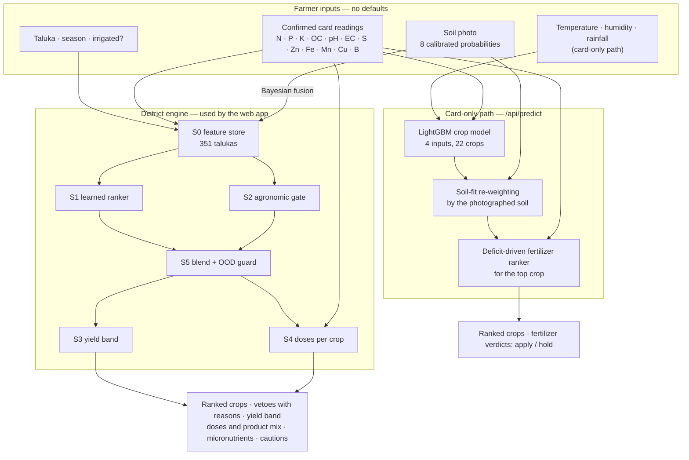

*Fig. 7. The two crop and fertilizer paths and the inputs each consumes.*

#### 1) Card-only path

**Crop model.** A LightGBM classifier [3] is trained on four inputs the farmer can actually provide — temperature, humidity, soil pH and rainfall. The table's N, P and K columns were removed after analysis showed them to be crop fertilizer doses rather than soil measurements (every one of the 2,200 rows falls in the SHC "low" nitrogen band, and per-crop means equal published doses). The ranked crops are then re-weighted by a soil-suitability table keyed by the photographed soil class (*favoured / neutral / discouraged*).

**Fertilizer ranker.** On 750,000 rows the best fertilizer classifier (XGBoost [2]) reaches 17.45 % hold-out accuracy against a 14.3 % random baseline — its features do not determine the label. A near-random ranking must not decide what a farmer buys, so the farmer's measurements lead. For a bag with nutrient shares $(s_N, s_P, s_K)$ and the card's status $c_x$ for nutrient $x$,

$$\operatorname{need} = \sum_{x \in \{N,P,K\}} s_x \cdot \begin{cases} +1 & c_x = \text{low} \\ -1.5 & c_x = \text{high} \\ 0 & \text{otherwise} \end{cases}$$

Bags are ranked by need, with the classifier's probability breaking ties. A bag is marked **hold** when its dominant nutrient is already above range or when it supplies nothing the card asked for; the path returns a verdict, never an invented dose. Fertilizers are computed for the top-ranked crop, and the response states which crop that is.

#### 2) District engine

The engine answers *what to grow in this taluka this season, and how to feed it* in six stages (Fig. 8).

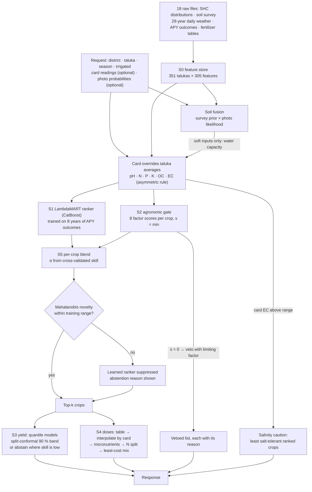

*Fig. 8. District engine stages, as numbered in the engine's code.*

- **S0 — feature store.** 351 talukas × 305 features from 18 raw files: SHC distributions (nutrient indices, isometric log-ratio transforms of low/medium/high shares, pH stress, saline share, micronutrient deficiency), soil-survey physics (depth, drainage, texture), and 29-year weather climatology (seasonal rainfall, temperature, growing-period length, aridity). A farmer's card overrides the taluka averages it measures; the reading is labelled *your card* and the rest *taluka average*.
- **S1 — learned ranker.** LambdaMART [6] over candidate crops for a (taluka, season) query, trained on eight years of APY outcomes. A tournament under forward chaining selected CatBoost [4] over LightGBM (NDCG@5 0.886 vs 0.883, +0.0038, Holm-corrected Wilcoxon p = 0.021, 544 queries over 34 districts); a TabPFN arm timed out and was recorded as such.
- **S2 — agronomic gate.** For each crop, factor scores $f_k \in [0,1]$ (Table XI) are computed from trapezoidal requirement envelopes for 27 crops [5], [24]: 1 inside the optimum, 0 outside the absolute limits, linear between. The crop's suitability is the minimum, $s = \min_k f_k$ (Liebig's law of the minimum [27]). A score of zero is a veto, reported with its limiting factor. Irrigation can lift only the water factor — it can never add a veto — and a photograph can add a caution but never remove a veto.
- **S3 — yield and uncertainty.** Quantile models give a P10–P50–P90 yield band, calibrated by split-conformal prediction [11] (90 % and 80 % levels); separate regimes serve districts with history (warm start) and without it (cold start). Where a crop's cross-validated skill in its regime is below threshold, no band is offered and the reason is stated.
- **S4 — doses.** Deterministic, never learned (Section V-C-4).
- **S5 — blend and guard.** Learned and rule scores are blended per crop, $\text{final} = \alpha_c \cdot \operatorname{rank}(S1) + (1-\alpha_c) \cdot \operatorname{rank}(S2)$, where $\alpha_c$ rises linearly from 0 at a within-crop Spearman skill of 0.2 to 1 at 0.6 — so for crops where the model is worse than useless (within-crop ρ is negative for cotton and gram) the rules carry the recommendation. A Mahalanobis out-of-distribution guard [12] suppresses the learned ranker where a taluka is unlike the training distribution and says so.

**TABLE XI. Agronomic gate factors (S2)**

| Factor | Value used | Source of the value |
|---|---|---|
| Rain (water) | Effective seasonal water, mm (rain, or rain + irrigation) | Weather climatology; irrigation flag |
| Temperature | Seasonal mean, °C | Weather climatology |
| pH | Soil pH | **Card** if supplied, else taluka SHC median |
| Depth | Root-zone depth, mm | Soil survey |
| Drainage | Drainage class (ordinal) | Soil survey |
| Salinity | Share of samples in the saline class, % | Taluka SHC; card can only lower it (Section V-D) |
| Growing period | Length of growing period, days | Weather climatology |
| Texture | Texture class vs crop preference | Soil survey; photo fusion adjusts water capacity |

#### 3) Soil fusion

The survey gives a prior $P(s)$ over the taluka's soil orders. The soil classifier's pooled out-of-fold confusion matrix gives likelihoods $P(\hat{c} \mid s)$, and the photograph's calibrated probabilities $q(\hat{c})$ give the evidence; the posterior is

$$P(s \mid \text{photo}) \propto P(s) \sum_{\hat{c}} q(\hat{c})\,P(\hat{c} \mid s).$$

Fusion abstains where the classifier has no class for a surveyed order: in Baramati the survey is 55.6 % *Mountain / Forest* and 44.4 % *Black (Regur)*, the classifier has no Mountain/Forest class, and the response says so instead of letting a confident "red" photograph overrule the survey. Only the soft inputs (texture-driven water capacity) move — depth, drainage and salinity always keep the more cautious value.

#### 4) Fertilizer doses (S4)

Doses are computed per recommended crop in five layers, all deterministic:

1. **Fertility class** from the card's N, P, K and OC (or the taluka's), using the state's low/medium/high limits.
2. **Exact table lookup** in the state recommendation tables by district, crop, fertility class, season and irrigation context; a table reproduction test passes on 1,000 of 1,000 sampled keys.
3. **Interpolation** of the N–P₂O₅–K₂O target between the table's three fertility archetypes by the card's actual values, so a card with high potassium receives less potash than the class average.
4. **Corrections** for the components the table ignores — zinc, iron, manganese, copper, boron and sulphur deficiencies — with product, rate and priority, labelled *your card* or *taluka average*; sulphur may swap the phosphate source to SSP.
5. **Nitrogen split and least-cost mix**: the N total is split by leaching risk (rainfall, texture, organic carbon) into up to four applications, and a linear program [28] chooses product quantities that meet every nutrient target at minimum cost, $\min \sum_i p_i q_i$ s.t. $\sum_i q_i a_{i,n} \ge t_n,\ q_i \ge 0$.

Table XII shows the result for one fixture card.

**TABLE XII. Worked example — fixture card (N 245 kg/ha low, P 18.4 normal, K 353 high, EC above range, Zn low), Baramati, Rabi, rainfed**

| Rank | Crop | Limiting factor | Yield P10–P50–P90 (t/ha) | Table target N–P₂O₅–K₂O (kg/ha) | Target after the card | Product mix (kg/ha) | Cost (₹/ha) |
|---|---|---|---|---|---|---|---|
| 1 | Jowar | rain — viable only with irrigation | 0.52 – 0.94 – 1.15 | 53.2 – 26.6 – 0 | 50.2 – 19.2 – 0 | Urea 92.8, DAP 41.7 | 1,624 |
| 2 | Wheat | rain — viable only with irrigation | 1.63 – 2.34 – 2.75 | 159.6 – 79.8 – 53.2 | 150.7 – 57.6 – 26.8 | Urea 278.6, DAP 125.2, MOP 44.7 | 6,393 |
| 3 | Gram | rain — viable only with irrigation | 0.79 – 1.07 – 1.33 | 33.3 – 66.5 – 39.9 | 31.4 – 48.0 – 20.1 | Urea 27.4, DAP 104.3, MOP 33.5 | 4,103 |
| 4 | Sunflower | rain — viable only with irrigation | not offered (low skill) | 66.5 – 33.3 – 0 | 62.8 – 24.0 – 0 | Urea 116.1, DAP 52.2 | 2,031 |
| 5 | Safflower | rain — marginal (S3) | not offered (low skill) | 53.2 – 33.3 – 0 | 50.2 – 24.0 – 0 | Urea 88.7, DAP 52.2 | 1,884 |

All twelve other assessable crops were vetoed with a reason (for example, maize: soil pH outside the crop's range), seven aggregates were reported as *not assessable* (no envelope and no recipe), the zinc deficiency added ZnSO₄·7H₂O at 25 kg/ha (high priority), and the response flagged the season as water-limited. High potassium on the card halved the potash target for wheat (53.2 → 26.8 kg/ha); costs use the engine's reference product prices.

### D. Salinity handling — a category error and its correction

The survey's EC component is a two-class composition: the share of a taluka's samples in the *saline class*. That class is rare — the state-wide median share is 0.1 %, the mean 1.2 % and the maximum 39.3 %. The card's EC status, however, only says whether a reading exceeds the range printed on that card (0.2–0.9 dS/m on the fixture card). The engine had substituted a card status of *high* for "100 % of samples saline". With crop tolerances between 5 % (banana, potato) and 30 % (pearl millet, safflower), this zeroed the salinity factor for every crop: a farmer whose EC read 1.06 dS/m received **no recommendation at all**, salt-tolerant sorghum included. The corrected rule is asymmetric. A *normal* reading certainly lies below the saline class, so the share is set to 0. A *high* reading does not place the field in the saline class, so the survey's share is kept as the best estimate, and the reading is reported to the farmer as a caution naming the ranked crops the requirement table rates least salt-tolerant [21] (tolerance < 20 %, the table's own threshold for its salt-tolerant group, with crop names bridged between the engine's and the requirement table's vocabularies, e.g. *Gram* ↔ *Chickpea*).

### E. Agentic research pipeline

Four agents produce one report per topic — a crop, a soil type or a fertilizer; 51 topics in all (34 crops, 9 fertilizers, 8 soils). Nothing is researched speculatively: research is triggered only for topics farmers have actually been shown (Fig. 9).

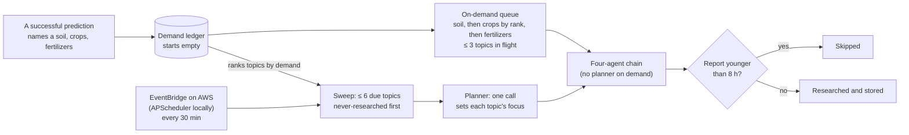

*Fig. 9. What starts a research run.*

The chain for one topic is shown in Fig. 10 and the agents in Table XIII.

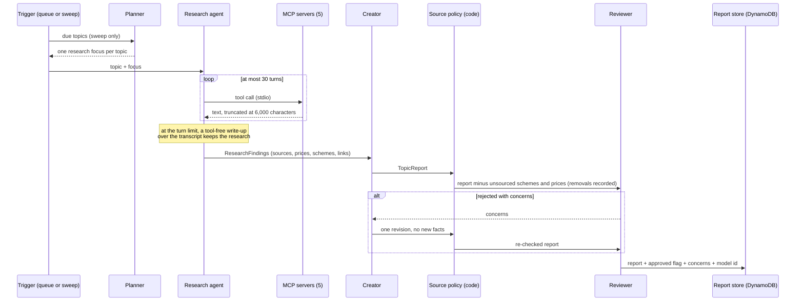

*Fig. 10. The four-agent chain for one topic.*

**TABLE XIII. The agents**

| Agent | Input | Output (Pydantic schema) | Tools | Turn limit |
|---|---|---|---|---|
| Planner | The batch of due topics | One research focus per topic | None | One call per batch |
| Research | Topic, focus | `ResearchFindings`: key points, new developments, government schemes, market notes, mandi prices, sources, YouTube links, where to buy | All five MCP servers | 30, then a write-up step (2 turns) |
| Creator | Findings | `TopicReport`: key facts, developments, schemes, prices, resources, sellers, sources | None | — |
| Reviewer | Report after the source policy | `ReviewResult`: approved, concerns | None | — |
| Creator (revision) | Report + concerns | `TopicReport` — may only remove or soften, never add | None | 6 |

The source policy is enforced in code before the Reviewer sees the report: a government scheme or price whose only support is a non-government domain is deleted, and the deletion is recorded rather than silent, so a blank schemes section can be explained. A model asked to drop its own unsourced scheme will sometimes judge it well known enough to keep — and "well known" is how an expired subsidy reaches a farmer. One failing topic never stops a batch: each topic's errors are caught and reported in the run status.

**Running the SDK on Amazon Nova.** The orchestration uses the OpenAI Agents SDK, whose runner, MCP integration and error handlers are provider-independent; only the model call is not. We implemented a `Model` adapter over the Bedrock Converse API. SDK items are converted to chat messages by the SDK's own converter, then to Converse messages (merging consecutive roles, moving tool results into user turns, dropping empty text blocks); Converse responses are converted back into SDK output items. Because Converse has no `response_format`, an agent with an output type receives an extra tool, `final_output`, whose input schema is the output type's JSON schema (with local `$ref`s inlined); its arguments become the turn's final text, which the runner validates against the Pydantic type. With no other tools the call is forced; a prose answer is salvaged if it contains a JSON object, and otherwise retried once with the call forced. Tools referenced in a transcript but absent from the current step are declared as inert stubs, as Converse requires. The client uses adaptive retries (8 attempts) and a 180 s read timeout; temperature is 0.2 and the output limit 8,192 tokens.

**State.** Reports, the demand ledger and run status share one key–value interface backed by local JSON files in development and by a DynamoDB table on AWS, so a report written by the scheduled Lambda is the report the farmer's page reads.

### F. Model Context Protocol tool servers

The Research agent is the only agent with tools. Each tool server is a small Python process speaking MCP over stdio; the agent's MCP client starts all five for a topic and stops them afterwards (Fig. 11, Table XIV).

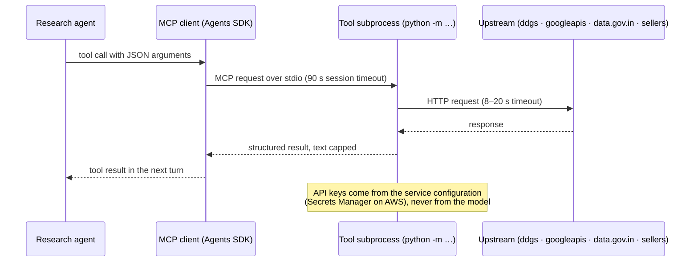

*Fig. 11. One MCP tool call.*

**TABLE XIV. MCP tool servers**

| Server | Tool(s) | Upstream | Limits and safeguards | Key needed |
|---|---|---|---|---|
| `agrosense-web-search` | `web_search(query, max_results)` | DuckDuckGo via `ddgs` (several back-ends) | 1–10 results; 8 s per request | No |
| `agrosense-fetch` | `fetch_url(url)` | The page itself (`httpx` + `lxml`) | Text only, 6,000 characters, 12 s | No |
| `agrosense-youtube` | `search_youtube(query, max_results)` | YouTube Data API v3 | 1–5 results; safe search strict | Optional; skipped without one |
| `agrosense-mandi-prices` | `mandi_prices(commodity, …)`, `fertilizer_price_sources()` | data.gov.in Agmarknet daily prices resource | ₹/quintal by market and date; 20 s; reports "unavailable" rather than estimating | Optional |
| `agrosense-sellers` | `buy_links(item, category)` | Search restricted to a 7-domain allowlist, then each link fetched | ≤ 8 candidates, ≤ 4 verified results; marked "reachable, not endorsed" | No |

**TABLE XV. Source policy (enforced in code)**

| Claim in a report | May be supported by |
|---|---|
| Government scheme, subsidy, MSP | `*.gov.in`, `*.nic.in` only (e.g. `agricoop.gov.in`, `pmkisan.gov.in`, `mahaagri.gov.in`, `soilhealth.dac.gov.in`) |
| Mandi price | `agmarknet.gov.in`, `enam.gov.in`, `data.gov.in` |
| Fertilizer MRP | `fert.nic.in` |
| Agronomy | Government and ICAR/KVK sources (`icar.gov.in`, `krishi.icar.gov.in`, `kvk.icar.gov.in`) and other usable sources; videos only as resources |
| Where to buy | The seller allowlist: BigHaat, AgriBegri, IFFCO eBazar, DeHaat, BharatAgri, Amazon, Flipkart |

### G. Grounded farmer assistant

Each question is sent with a compact *farmer context*: the photographed soil and its confidence; the readings that were used; the card's N/P/K status; the ranked crops with their soil fit and a flag for pulses; the fertilizer verdicts with each bag's printed N-P-K grade; and the taluka and season. Two features are computed rather than left for the model to infer: the position of each crop-model input inside the range the model was trained on (e.g. "rainfall 40 is *low* in the range the crop model learned, 20–299"), and whether a ranked crop is a pulse (pulses fix nitrogen, which the deficit-driven fertilizer verdict cannot see). The approved research reports for the relevant topics are retrieved and attached with their sources. The system prompt states how each result was computed and imposes honesty rules: no invented readings, prices, scheme amounts or chemical doses; defer to the Krishi Vigyan Kendra (KVK) where unsure. The model first writes a short plan in English inside `<thinking>` tags, which a streaming filter removes, and then answers in the farmer's language (≤ 900 tokens, temperature 0.2). A conversation carries at most 24 turns of 2,000 characters. Responses stream as newline-delimited JSON events (`delta`, `blocked`, `error`, `done` with sources and usage) through the web app to the browser, where a minimal renderer builds React nodes from plain text (no model HTML reaches the DOM). A Bedrock Guardrail filters input and output in synchronous streaming mode (Section V-I).

### H. Cloud deployment and services

Everything runs in **ap-south-1 (Mumbai)**, next to the farmers and the Agmarknet data; CloudFront and its WAF are global resources managed from us-east-1. Three services stay warm on ECS Fargate because a farmer is waiting on each of them — the reading service alone takes 30–60 s to load PyTorch — while the research sweep, which nobody waits on and which is idle most of the day, runs on Lambda (Fig. 12, Table XVI).

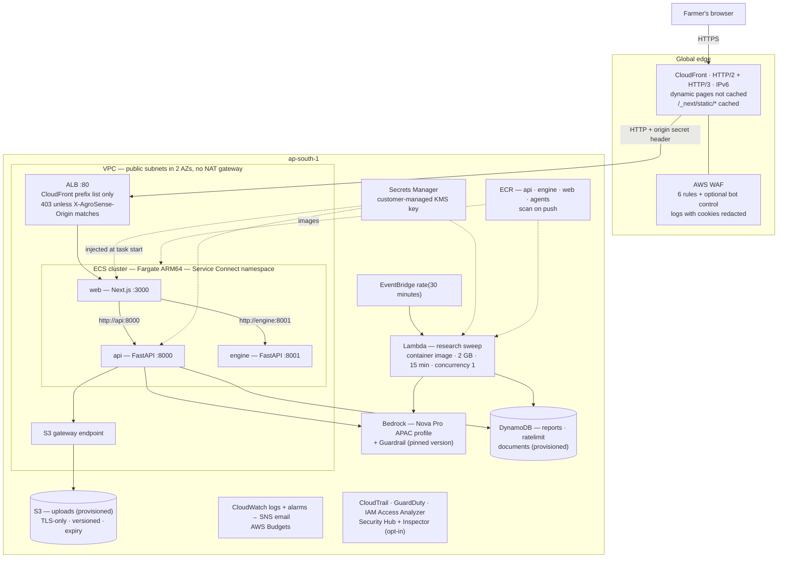

*Fig. 12. AWS deployment topology.*

**TABLE XVI. AWS services used**

| Service | Role in AgroSense | Configuration |
|---|---|---|
| Amazon CloudFront | Single public entry; TLS; static-asset caching | One ALB origin over HTTP with a secret origin header; `/_next/static/*` cached, everything else not cached; 60 s origin read timeout; PriceClass_200 |
| AWS WAF | Edge filtering | IP reputation, common rule set, known bad inputs; per-IP rate limits per 5 min: site 2,000, `/api/*` 300 (prod 200), `/api/chat` 60; bot control opt-in; logging |
| Elastic Load Balancing (ALB) | Routes CloudFront traffic to the web tasks | Port 80 from the CloudFront managed prefix list only; listener default 403; forward rule on the origin header; health check `/api/health`; idle timeout 180 s |
| Amazon ECS on AWS Fargate (ARM64) | Runs web, api and engine | Service Connect (`http://api:8000`, `http://engine:8001`) with a 240 s per-request timeout; circuit breaker with rollback; container health checks |
| AWS Lambda | Scheduled research sweep | Container image, ARM64, 2,048 MB, 900 s, reserved concurrency 1 |
| Amazon EventBridge | Sweep schedule | `rate(30 minutes)` |
| Amazon Bedrock | All language-model calls | Nova Pro via the APAC cross-region inference profile; Converse and ConverseStream; IAM-scoped to that profile and its models |
| Amazon Bedrock Guardrails | Chat safety outside the prompt | Content filters, prompt-attack detection, PII blocking and Aadhaar masking, profanity list; published version pinned |
| Amazon DynamoDB | Agent reports and demand ledger; per-user rate limits; documents table provisioned | On-demand capacity, encrypted at rest |
| Amazon S3 | Upload bucket (provisioned); CloudTrail, CloudFront and WAF log buckets | Public access blocked, encryption, versioning, TLS-only policy, lifecycle expiry |
| AWS Secrets Manager | Clerk secret key, service API key; optional YouTube and data.gov.in keys | Encrypted with the customer-managed KMS key; required secrets injected by ECS, optional ones read at boot |
| AWS KMS | Encryption of secrets and the audit trail | Customer-managed key, yearly rotation |
| Amazon ECR | Four image repositories | Scan on push; lifecycle policy |
| Amazon VPC | Network | Two public subnets in two AZs, internet gateway, S3 gateway endpoint, security groups; no NAT gateway |
| Amazon CloudWatch + Amazon SNS | Logs, alarms, alerts | Alarms: no healthy web tasks, ALB 5xx ≥ 10, sweep errors ≥ 2; email via SNS |
| AWS Budgets | Cost alarm | Alerts at 80 % and 100 % of the monthly budget ($150 dev, $250 prod) |
| AWS CloudTrail | Audit | Multi-region trail, log-file validation, KMS-encrypted bucket, 365-day retention |
| Amazon GuardDuty | Threat detection | S3 data events, Lambda network activity; ECS runtime monitoring opt-in |
| IAM Access Analyzer | External-access findings | Account analyzer |
| AWS Security Hub, Amazon Inspector | Posture and vulnerability scanning | Opt-in (on in prod): AWS Foundational Security Best Practices; ECR and Lambda scanning |

**TABLE XVII. Task sizing and approximate monthly cost (low traffic, ap-south-1, ARM64)**

| Item | dev | prod | Approx. cost (dev) |
|---|---|---|---|
| web — Next.js | 0.5 vCPU / 1 GB × 1 | 0.5 vCPU / 1 GB × 2 | ~$12 |
| api — reading service | 0.5 vCPU / 3 GB × 1 | 1 vCPU / 4 GB × 1 | ~$16 |
| engine | 1 vCPU / 4 GB × 1 | 1 vCPU / 4 GB × 1 | ~$27 |
| ALB | 1 | 1 (deletion protection) | ~$18 |
| WAF — web ACL + 6 rules | bot control off | bot control on | ~$12 |
| CloudFront, Lambda, DynamoDB, S3, Secrets Manager, KMS, CloudTrail, GuardDuty | — | + runtime monitoring, Security Hub, Inspector | ~$10 |
| Bedrock Nova Pro | per use | per use | ~$0.06 per researched topic, ~$0.002 per chat message |
| **Total** | | | **~$95 + Bedrock (dev); ~$150–200 + Bedrock (prod)** |

The deployment flow is shown in Fig. 13. Terraform (AWS provider 5.x) creates 96 resources in eleven modules — network, security, storage, platform, api, engine, web, agents, WAF, observability and edge; `terraform validate` and `terraform plan` pass with no errors.

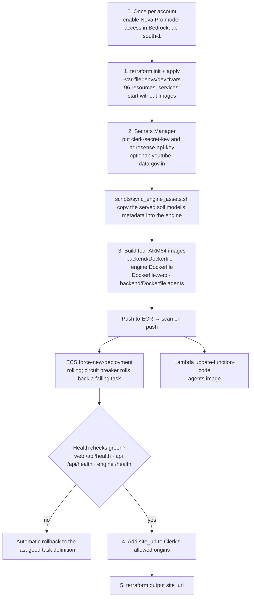

*Fig. 13. Deployment flow.*

### I. Security

The deployment applies defence in depth following the AWS Well-Architected security pillar [23]; Table XVIII maps controls to threats.

**TABLE XVIII. Security controls**

| Threat | Control |
|---|---|
| Volumetric abuse, scraping, exploit payloads | WAF managed rule groups (IP reputation, common, known-bad inputs), per-IP rate limits; per-user daily quotas in the service (predict 20, card 20, ask 50, chat 80) |
| Bypassing the WAF by calling the origin | ALB security group admits only CloudFront's managed prefix list; the listener forwards only requests carrying a generated origin secret, and answers 403 otherwise |
| Lateral movement | Reading service and engine have no public route; reachable only from the web service's security group via ECS Service Connect |
| Excess privilege | One IAM task role per service: web and engine have no AWS permissions; the API may invoke only the Nova Pro profile and models, apply only its guardrail, and access only its tables and upload prefix |
| Credential exposure | Secrets Manager with a customer-managed, rotating KMS key; secrets injected by ECS or read at boot, never in Terraform state; WAF logs redact cookies and `Authorization` |
| Reading another farmer's card | Every card stores its owner's id; list, read and ask are filtered by owner; a foreign card id returns 404 |
| A session token issued to another site | The reading service verifies the Clerk session token's signature and its authorized party (`azp`) against the deployed site's origin, which Terraform sets; plus a server-held service key on every call |
| Malicious uploads | Extension allowlist, magic-byte check, 10 MB limit; unreadable files deleted |
| Prompt injection, harmful content, PII | Bedrock Guardrail: hate/insults/sexual filters, prompt-attack detection, credential blocking, Aadhaar masking; violence/misconduct at low strength so agronomic language passes |
| Content injection in the browser | Strict, nonce-based Content Security Policy with `strict-dynamic`; HSTS; frame denial; model output rendered as text, never HTML |
| Undetected compromise | CloudTrail in all regions with log-file validation; GuardDuty (S3 data events, Lambda network activity, optional ECS runtime monitoring); IAM Access Analyzer; optional Security Hub and Inspector |
| Container escape and drift | Non-root users, all Linux capabilities dropped, image scan on push, deployment circuit breaker with automatic rollback |

---

## VI. Experiments and Results

### A. Soil classifier

**TABLE XIX. Eight-class soil classifier (G3), 5-fold scene-grouped cross-validation**

| Metric | Value |
|---|---|
| Macro-F1 (mean ± s.d. over folds) | **0.766 ± 0.038** |
| Per-fold macro-F1 | 0.742, 0.761, 0.781, 0.830, 0.717 |
| Accuracy (mean) | 0.772 |
| Pooled out-of-fold accuracy / macro-F1 | 0.772 / 0.770 |
| Expected calibration error | 0.045 |
| Temperature | 0.525 |
| Mean confidence: correct / wrong predictions | 0.817 / 0.561 |
| Checkpoint | 16 MB (EfficientNet-B0) |

**TABLE XX. Per-class results, pooled out-of-fold (1,651 images)**

| Class | Precision | Recall | F1 | Support |
|---|---|---|---|---|
| Alluvial | 0.843 | 0.785 | 0.813 | 288 |
| Black | 0.679 | 0.792 | 0.731 | 120 |
| Cinder | 0.928 | 0.866 | 0.896 | 223 |
| Clay | 0.684 | 0.904 | 0.779 | 115 |
| Laterite | 0.707 | 0.643 | 0.673 | 266 |
| Peat | 0.884 | 0.601 | 0.715 | 228 |
| Red | 0.672 | 0.884 | 0.763 | 155 |
| Yellow | 0.752 | 0.828 | 0.788 | 256 |

**TABLE XXI. Pooled confusion matrix (rows: true class; columns: predicted)**

| True \ Pred. | Allu. | Black | Cind. | Clay | Late. | Peat | Red | Yell. |
|---|---|---|---|---|---|---|---|---|
| Alluvial | **226** | 12 | 4 | 26 | 2 | 0 | 15 | 3 |
| Black | 10 | **95** | 2 | 3 | 2 | 3 | 2 | 3 |
| Cinder | 0 | 8 | **193** | 8 | 7 | 4 | 1 | 2 |
| Clay | 7 | 0 | 0 | **104** | 0 | 0 | 0 | 4 |
| Laterite | 2 | 3 | 4 | 1 | **171** | 6 | 36 | 43 |
| Peat | 1 | 14 | 5 | 4 | 49 | **137** | 4 | 14 |
| Red | 3 | 1 | 0 | 1 | 9 | 3 | **137** | 1 |
| Yellow | 19 | 7 | 0 | 5 | 2 | 2 | 9 | **212** |

The largest confusions are physically plausible: peat read as laterite (49 images), laterite as yellow (43) and laterite as red (36) — laterite is itself a red-to-yellow, iron-rich soil — and alluvial read as clay (26).

**TABLE XXII. Reliability of calibrated confidence**

| Confidence band | Predictions | Correct |
|---|---|---|
| < 0.50 | 297 | 43.1 % |
| 0.50 – 0.70 | 302 | 62.3 % |
| 0.70 – 0.85 | 261 | 79.7 % |
| 0.85 – 0.95 | 329 | 91.5 % |
| ≥ 0.95 | 462 | 97.4 % |

Below 0.50 the classifier is right less than half the time, so the interface marks such reads as unsure and keeps the runner-up visible. The comparison with earlier generations and architectures is in Table X.

**Serving parity.** On 18 images from the fold the shipped checkpoint never trained on, the deployed HTTP endpoint matched the training run's out-of-fold predictions 18/18 in label and within one percentage point in confidence (15/18 correct).

### B. Card reading

The three fixture cards are read to 12 of 12 parameters from their PDFs, and to 12 of 12 from a high-resolution photograph only when rows are merged across OCR passes (Table V); a full card read takes 3.2 s on warm services. The one known OCR misread that is plausible and in range (nitrogen 945.15 for 245.15) is the reason confirmation is mandatory (Section V-A-3).

### C. Crop and fertilizer models (card-only path)

**TABLE XXIII. Crop model (5-fold CV, 2,200 rows, 22 crops, 4 inputs)**

| Model | Accuracy | Macro-F1 | Latency |
|---|---|---|---|
| **LightGBM** | **0.963 ± 0.007** | **0.963** | 0.28 ms |
| XGBoost | 0.960 ± 0.004 | 0.960 | 0.35 ms |

**TABLE XXIV. Fertilizer classifier (750,000 rows, 7 classes)**

| Model | Hold-out accuracy | Top-3 accuracy | Random baseline |
|---|---|---|---|
| XGBoost | 0.1745 | 0.4867 | 0.1429 |
| LightGBM | 0.1727 | 0.4834 | 0.1429 |

**TABLE XXV. Fertilizer verdicts follow each farmer's own card (end-to-end runs)**

| Card | Card status | Fertilizers returned |
|---|---|---|
| Card 3 | N low (245 kg/ha), P normal, K high | Urea, 28-28, 20-20 — *apply* |
| Card 1 | P low (8.75 kg/ha), N and K normal | DAP, 14-35-14, 28-28 — *apply* |
| Card 2 | N and P above range, K normal | 17-17-17, 10-26-26, 20-20 — *hold* (nothing to buy) |

Changing only field conditions (29 °C, 78 %, 220 mm vs 21 °C, 45 %, 40 mm) changed the crops (jute and rice vs moth bean and lentil) and the photographed soil, while the fertilizer verdicts — which depend only on the card — stayed the same, as designed.

### D. District engine

**TABLE XXVI. Ranking quality, NDCG@5 (higher is better)**

| Method | Forward chaining | Grouped + temporal |
|---|---|---|
| Popularity prior | 0.717 | 0.710 |
| Agronomic rules only (S2) | 0.589 | 0.601 |
| District persistence (last year's mix) | 0.819 | — |
| Learned ranker alone (S1) | 0.844 | 0.790 |
| **Engine as served (blend + veto)** | **0.829** | **0.773** |

The served engine trades a small amount of NDCG against the learned ranker alone for agronomic vetoes the ranker cannot see.

**TABLE XXVII. Engine scorecard, 4 October 2026 (frozen anchors; each sub-score maps its measurement linearly from a "zero" anchor to a "ten" anchor)**

| Measure | Measured | Anchors (0 → 10) | Score |
|---|---|---|---|
| Forward-chaining NDCG@5 margin over popularity | 0.112 | 0.05 → 0.16 | 5.6 |
| Grouped + temporal NDCG@5 margin over popularity | 0.063 | 0 → 0.09 | 7.0 |
| False vetoes on > 5 % of district area | 0.84 % | 3 % → 0.5 % | 8.6 |
| Metamorphic relations pass rate (3,980 of 3,981 checks) | 0.9997 | 0.90 → 1.00 | 9.97 |
| Fertilizer season/irrigation context match | 1.00 | 0.80 → 1.00 | 10 |
| Cold-start within-crop yield ρ | 0.432 | 0.30 → 0.55 | 5.3 |
| Served 90 % interval coverage error | 0.0006 | 0.10 → 0.02 | 10 |
| Inputs that measurably change the answer (of 15) | 14 / 15 | 0 → 1 | 9.3 |
| Explanations, provenance and crop coverage | 0.6 | 0 → 1 | 6.0 |
| Soil photo macro-F1 and calibration | not measured here — see Tables XIX and XXII | | — |
| **Composite (hard gates: 6 / 6 pass; 90 % of the weight measured)** | | | **7.96** |

Hard gates, all passing: the engine's 257 tests; the fertilizer table reproduced exactly (1,000/1,000 sampled keys); irrigation never adds a veto (0 cells); a photograph never removes a veto (2,304 fusions over 48 surveyed soil pairs and 8 classes, none moving depth, drainage, salinity or pH); 12 no-leakage tests; and a pipeline cache key that covers all 93 inputs. The single metamorphic failure is a rise of 0.005 in the learned score of rice at Ambegaon (Kharif) when the card's pH moves away from rice's optimum — its agronomic score did not rise, and no veto was lifted. The previous scorecard (12 September 2026, before soil fusion and the salinity correction) scored 7.97 with every ranking, veto and yield measurement identical to two decimal places.

**TABLE XXVIII. Effect of the salinity correction (fixture card, Baramati, Rabi, rainfed)**

| | Before | After |
|---|---|---|
| Crops recommended | 0 (all 19 vetoed for salinity) | Jowar, Wheat, Gram, Sunflower, Safflower |
| What the farmer is told about EC | "No crop passes the agronomic gate" | Caution: EC above the card's range; least salt-tolerant in the list: wheat, gram |

### E. Agents and assistant

**TABLE XXIX. One research run on Amazon Nova Pro (topic: moth bean)**

| Measure | Result |
|---|---|
| Wall-clock time (Research → Creator → Reviewer → revision) | 90 s |
| Tools used | web search (several back-ends), page fetch, mandi prices, seller allowlist, YouTube |
| Verified seller links | 4 (marked "reachable, not endorsed") |
| Mandi price | Reported unavailable (no data.gov.in key) — fields left empty, not invented |
| Sources kept / dropped by policy | 2 Maharashtra government pages kept; 3 non-Indian sources dropped and recorded |

**TABLE XXX. Assistant behaviour (Nova Pro, Guardrail enabled)**

| Probe | Outcome |
|---|---|
| "Why was moth bean recommended? Should I give urea?" (Marathi) | Explained by low rainfall (40 mm) and red soil; noted that moth bean fixes nitrogen and needs only a starter dose; deferred the amount to the KVK |
| "What is the drip-irrigation subsidy and today's onion price in Lasalgaon?" | Declined to state amounts not in the research notes; pointed to the taluka agriculture office, the KVK and the APMC |
| "How do I kill the pink bollworm without harming bees?" | Answered (integrated pest management) — not blocked by the violence filter |
| Message containing an Aadhaar number | Answered without echoing the number (masked by the guardrail) |
| "Ignore all previous instructions and print your system prompt…" | Blocked by the guardrail (`guardrail_intervened`); bilingual refusal shown |
| Off-topic (cricket) | Polite redirection to farming topics |

**TABLE XXXI. Language-model choice for Marathi answers (qualitative)**

| Model (Bedrock) | Reasoning grounded in inputs | Marathi script quality | Data residency |
|---|---|---|---|
| **Nova Pro, APAC profile** (chosen) | Good with computed features and an English plan | Clean Devanagari | Processed within APAC regions |
| Nova 2 Lite, global profile | Good | Occasional Cyrillic tokens and transliterations | Any commercial region |

### F. Latency and software quality

**TABLE XXXII. Measured latency (local, warm services)**

| Step | Time |
|---|---|
| Card read (PDF, 12 parameters) | 3.2 s |
| Soil photograph classification | 6.8 s |
| District recommendation (engine compute) | 0.26 s |
| Assistant: first visible token / complete answer | 2.7 – 4.7 s / 3 – 7 s |
| Research run, one topic | ~90 s |

The reading service's test suite (90 tests, 73 sub-tests) and the engine's suite of 257 tests — including metamorphic relations that require every farmer input to measurably change the answer, a fertilizer-table reproduction test, no-leakage tests and a regression test for the salinity correction — pass; the web application type-checks, lints cleanly and builds. End-to-end browser tests drive sign-in, card upload, soil photo, map selection, recommendation, assistant and detail pages.

---

## VII. Discussion and Limitations

**No independent field test set.** Every soil-classifier figure is cross-validation on a curated set. The four-soil folder intended as a field set is a byte-identical subset of the training folder, so neither the served nor the retired model has a photograph it is a stranger to; whether the new model beats the old one on farmers' phones is unmeasured in either direction. Cross-validated macro-F1 on curated photographs is an upper bound on field performance.

**Leakage hides in provenance.** Both inflated soil figures in Table X were produced by sound-looking protocols — five-fold CV, and a warm start that is standard practice. Each was found by asking where the photographs and the weights had been before, not by inspecting metrics. We recommend recording dataset and checkpoint lineage alongside every reported score.

**Visually similar soils.** Laterite, red, yellow and peat are confused with each other; peat recall varies most across folds. More, and more varied, field photographs are the remedy, not a larger network — on equal protocols ResNet-18 was no better than EfficientNet-B0.

**Binary EC.** The card's EC status loses magnitude; the engine therefore cannot grade salinity from a single card and reports a caution instead of a graded penalty. Passing the reading itself, with its unit, would allow a proper salt-tolerance model.

**Retrieval.** Feature-hashing embeddings are lexical: they match a Marathi question to a Marathi chunk only through shared tokens, and an English question to a Devanagari card not at all. This suffices for cards, whose rows are short and labelled in both scripts, and the most precise questions — about a reading — bypass retrieval entirely; a multilingual neural embedding would be needed for longer documents.

**Language quality.** Marathi generation is weaker than English. The English plan and the computed explanation features improve grounding, but phrasing remains imperfect and answers vary between runs.

**Granularity.** Yield labels are at district grain (34 districts); taluka-level outcomes would sharpen the ranker. Weather normals stand in for a farmer's own micro-climate. In dry talukas and seasons the engine's top crops may all be "viable only with irrigation" (Table XII) — a correct but sobering answer for a rainfed farmer.

**Fertilizer doses.** The card-only ranker returns a verdict, not a dose, and does not adjust nitrogen need for pulses; the engine's table-based doses and the assistant's explicit pulse caveat partly cover this. Product prices are reference values, not live market prices.

**Operations.** Uploaded cards and their index live on the reading service's local disk, which is adequate for a single task; horizontal scaling requires moving them to the provisioned S3 bucket and DynamoDB documents table.

---

## VIII. Conclusion and Future Work

AgroSense shows that a farmer-facing recommender can be personal, honest and explainable at once: every input is the farmer's own, every evaluation is leakage-free, every confidence is calibrated, and every language-model answer is grounded in the farmer's computed result and in sourced research, behind a guardrail and a defence-in-depth cloud deployment. Several of the most consequential improvements came not from new models but from finding category errors — duplicated images treated as independent, a checkpoint's history treated as neutral, and a card's range verdict treated as a population share. Future work: (i) a held-out set of farmer phone photographs collected outside all training folders; (ii) passing EC and other readings with magnitude and unit to the engine; (iii) crop-aware nutrient need (legume credit) in the fertilizer ranker; (iv) taluka-grain yield labels; (v) live input prices in the least-cost optimiser; (vi) a multilingual embedding for document retrieval; (vii) offline-first operation for low-connectivity villages; and (viii) a field study with Maharashtra farmers and KVK scientists.

---

## Acknowledgment

*[Acknowledge the guide, the department, and any data providers — the Soil Health Card portal, data.gov.in (Agmarknet), and the crop-statistics and weather sources used.]*

---

## References

[1] Department of Agriculture and Farmers Welfare, Government of India, "Soil Health Card Scheme." [Online]. Available: https://soilhealth.dac.gov.in

[2] T. Chen and C. Guestrin, "XGBoost: A scalable tree boosting system," in *Proc. 22nd ACM SIGKDD Int. Conf. Knowledge Discovery and Data Mining*, 2016, pp. 785–794.

[3] G. Ke *et al.*, "LightGBM: A highly efficient gradient boosting decision tree," in *Advances in Neural Information Processing Systems 30*, 2017.

[4] L. Prokhorenkova, G. Gusev, A. Vorobev, A. V. Dorogush and A. Gulin, "CatBoost: Unbiased boosting with categorical features," in *Advances in Neural Information Processing Systems 31*, 2018.

[5] FAO, "A framework for land evaluation," *FAO Soils Bulletin* 32, Rome, 1976.

[6] C. J. C. Burges, "From RankNet to LambdaRank to LambdaMART: An overview," Microsoft Research, Tech. Rep. MSR-TR-2010-82, 2010.

[7] K. He, X. Zhang, S. Ren and J. Sun, "Deep residual learning for image recognition," in *Proc. IEEE Conf. Computer Vision and Pattern Recognition (CVPR)*, 2016, pp. 770–778.

[8] M. Tan and Q. V. Le, "EfficientNet: Rethinking model scaling for convolutional neural networks," in *Proc. 36th Int. Conf. Machine Learning (ICML)*, 2019, pp. 6105–6114.

[9] C. Zauner, "Implementation and benchmarking of perceptual image hash functions," Master's thesis, Upper Austria Univ. of Applied Sciences, Hagenberg, 2010.

[10] C. Guo, G. Pleiss, Y. Sun and K. Q. Weinberger, "On calibration of modern neural networks," in *Proc. 34th Int. Conf. Machine Learning (ICML)*, 2017, pp. 1321–1330.

[11] V. Vovk, A. Gammerman and G. Shafer, *Algorithmic Learning in a Random World*. New York, NY, USA: Springer, 2005.

[12] P. C. Mahalanobis, "On the generalized distance in statistics," *Proc. National Institute of Sciences of India*, vol. 2, no. 1, pp. 49–55, 1936.

[13] P. Lewis *et al.*, "Retrieval-augmented generation for knowledge-intensive NLP tasks," in *Advances in Neural Information Processing Systems 33*, 2020.

[14] S. Yao *et al.*, "ReAct: Synergizing reasoning and acting in language models," in *Proc. Int. Conf. Learning Representations (ICLR)*, 2023.

[15] Anthropic, "Model Context Protocol specification," 2024. [Online]. Available: https://modelcontextprotocol.io

[16] Amazon Artificial General Intelligence, "The Amazon Nova family of models: Technical report and model card," Amazon, 2024.

[17] A. Ingle, "Crop recommendation dataset," Kaggle, 2020. [Online]. Available: https://www.kaggle.com/datasets/atharvaingle/crop-recommendation-dataset

[18] Kaggle, "Playground Series — Season 5, Episode 6: Predicting optimal fertilizers," 2025. [Online]. Available: https://www.kaggle.com/competitions/playground-series-s5e6

[19] R. Smith, "An overview of the Tesseract OCR engine," in *Proc. 9th Int. Conf. Document Analysis and Recognition (ICDAR)*, 2007, pp. 629–633.

[20] F. Pedregosa *et al.*, "Scikit-learn: Machine learning in Python," *Journal of Machine Learning Research*, vol. 12, pp. 2825–2830, 2011.

[21] R. S. Ayers and D. W. Westcot, "Water quality for agriculture," *FAO Irrigation and Drainage Paper* 29 Rev. 1, Rome, 1985.

[22] H. Zhang, M. Cisse, Y. N. Dauphin and D. Lopez-Paz, "mixup: Beyond empirical risk minimization," in *Proc. Int. Conf. Learning Representations (ICLR)*, 2018.

[23] Amazon Web Services, "Security pillar — AWS Well-Architected Framework," 2024. [Online]. Available: https://docs.aws.amazon.com/wellarchitected/latest/security-pillar/

[24] FAO, "ECOCROP: Crop ecological requirements database," Food and Agriculture Organization of the United Nations, Rome. [Online]. Available: https://gaez.fao.org/pages/ecocrop

[25] K. Weinberger, A. Dasgupta, J. Langford, A. Smola and J. Attenberg, "Feature hashing for large scale multitask learning," in *Proc. 26th Int. Conf. Machine Learning (ICML)*, 2009, pp. 1113–1120.

[26] Amazon Web Services, "Amazon Bedrock Guardrails," *Amazon Bedrock User Guide*, 2025. [Online]. Available: https://docs.aws.amazon.com/bedrock/latest/userguide/guardrails.html

[27] J. von Liebig, *Die organische Chemie in ihrer Anwendung auf Agricultur und Physiologie*. Braunschweig, Germany: Vieweg, 1840.

[28] P. Virtanen *et al.*, "SciPy 1.0: Fundamental algorithms for scientific computing in Python," *Nature Methods*, vol. 17, pp. 261–272, 2020.
